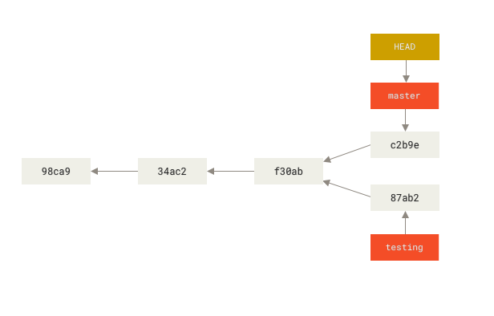
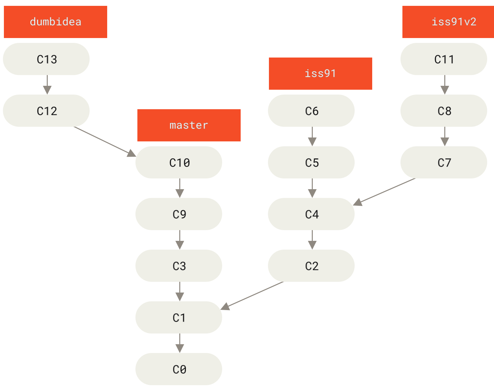

# Git Branching

 Nahezu jedes VCS
unterstützt eine Form von Branching. Branching bedeutet, dass Sie von
der Hauptlinie der Entwicklung abzweigen und Ihre Arbeit fortsetzen,
ohne an der Hauptlinie herumzubasteln. In vielen VCS-Tools ist das ein
etwas aufwändiger Prozess, bei dem Sie oft eine neue Kopie Ihres
Quellcode-Verzeichnisses erstellen müssen, was bei großen Projekten viel
Zeit in Anspruch nehmen kann.

Manche Leute bezeichnen Gits Branching-Modell als dessen
„Killer-Feature“, was Git zweifellos vom Rest der VCS-Community abhebt.
Was ist das Besondere daran? Die Art und Weise, wie Git Branches anlegt,
ist unglaublich leichtgewichtig, wodurch Branch-Operationen nahezu
verzögerungsfrei ausgeführt werden und auch das Hin- und Herschalten
zwischen einzelnen Entwicklungszweigen meistens genauso schnell abläuft.
Im Gegensatz zu anderen VCS ermutigt Git zu einer Arbeitsweise mit
häufigem Branching und Merging, sogar mehrmals am Tag. Wenn Sie diese
Funktion verstehen und beherrschen, besitzen Sie ein mächtiges und
einmaliges Werkzeug, welches Ihre Art zu entwickeln vollständig
verändern kann.

## Branches auf einen Blick

Um richtig zu verstehen, wie Git das Verzweigen realisiert, müssen wir
einen Schritt zurücktreten und untersuchen, wie Git seine Daten
speichert.

Wie Sie vielleicht aus Kapitel 1
[ch01-getting-started.xml](ch01-getting-started.xml#what_is_git_section)
in Erinnerung haben, speichert Git seine Daten nicht als Serie von
Änderungen oder Unterschieden, sondern statt dessen als eine Reihe von
*Snapshots*.

Wenn Sie einen Commit durchführen, speichert Git ein Commit-Objekt, das
einen Zeiger auf den Snapshot des von Ihnen bereitgestellten Inhalts
enthält. Dieses Objekt enthält auch den Namen und die E-Mail-Adresse des
Autors, die Nachricht, die Sie eingegeben haben, und zeigt auf den
Commit oder die Commits, die direkt vor diesem Commit stattfanden (zu
seinem Vorgänger bzw. seinen Vorgängern): keine Vorgänger für den ersten
Commit, einen Vorgänger für einen normalen Commit und mehrere Vorgänger
für einen Commit, welcher aus dem Zusammenführen (engl. mergen) von zwei
oder mehr Branches resultiert.

Um das zu veranschaulichen, lassen Sie uns annehmen, Sie haben ein
Verzeichnis, welches drei Dateien enthält, und Sie fügen alle Dateien
zur Staging-Area hinzu und führen einen Commit durch. Durch das
Hinzufügen der Dateien zur Staging-Area erzeugt Git für jede Datei eine
Prüfsumme (den SHA-1-Hashwert, den wir in Kapitel 1
[ch01-getting-started.xml](ch01-getting-started.xml#what_is_git_section)
erwähnt haben), speichert diese Version der Datei im Git-Repository (Git
verweist auf diese als *blobs*) und fügt die Prüfsumme der Staging-Area
hinzu:

    $ git add README test.rb LICENSE
    $ git commit -m 'Initial commit'

Wenn Sie mit der Anweisung `git commit` einen Commit erzeugen, berechnet
Git für jedes Unterverzeichnis (in diesem Fall nur das Wurzelverzeichnis
des Projektes) eine Prüfsumme und speichert diese als *tree*-Objekt im
Git-Repository. Git erzeugt dann ein commit-Objekt, welches die
Metadaten und einen Zeiger zum tree-Objekt des Wurzelverzeichnisses
enthält, sodass es bei Bedarf den Snapshot erneut erzeugen
kann.

Ihr Git-Repository enthält jetzt fünf Objekte: drei *blobs* (die jeweils
den Inhalt einer der drei Dateien repräsentieren), ein *tree*-Objekt,
welches den Inhalt des Verzeichnisses auflistet und angibt, welcher
Dateiname zu welchem Blob gehört, und ein *commit*-Objekt mit dem
Zeiger, der auf die Wurzel des Projektbaumes und die Metadaten des
Commits verweist.

<figure>

<figcaption aria-hidden="true">Ein Commit und sein Tree</figcaption>
</figure>

Wenn Sie einige Änderungen vornehmen und wieder einen Commit
durchführen, speichert dieser einen Zeiger zu dem Commit, der
unmittelbar davor gemacht wurde.

<figure>

<figcaption aria-hidden="true">Commits und ihre Vorgänger</figcaption>
</figure>

Ein Branch in Git ist einfach ein leichter, beweglicher Zeiger auf einen
dieser Commits. Die Standardbezeichnung für einen Branch bei Git lautet
`master`. Wenn Sie damit beginnen, Commits durchzuführen, erhalten Sie
einen `master` Branch, der auf den letzten Commit zeigt, den Sie gemacht
haben. Jedes Mal, wenn Sie einen Commit durchführen, bewegt er sich
automatisch vorwärts.

Der „master“-Branch in Git ist kein spezieller
Branch. Er ist genau wie
jeder andere Branch. Der einzige Grund dafür, dass nahezu jedes
Repository einen „master“-Branch hat, ist der Umstand, dass die
Anweisung `git init` diesen standardmäßig erzeugt und die meisten Leute
sich nicht darum kümmern, den Namen zu ändern.

<figure>

<figcaption aria-hidden="true">Ein Branch und sein
Commit-Verlauf</figcaption>
</figure>

### Erzeugen eines neuen Branches

Was passiert, wenn Sie einen neuen Branch anlegen? Nun, wenn Sie das
tun, wird ein neuer Zeiger (Pointer) erstellt, mit dem Sie sich in der
Entwicklung fortbewegen können. Nehmen wir an, Sie erzeugen einen neuen
Branch mit dem Namen „testing“. Das machen Sie mit der Anweisung
`git branch`:

    $ git branch testing

Dieser Befehl erzeugt einen neuen Zeiger, der auf denselben Commit
zeigt, auf dem Sie sich gegenwärtig befinden.

<figure>

<figcaption>Zwei Branches, die auf dieselbe Serie von Commits
zeigen</figcaption>
</figure>

Woher weiß Git, auf welchem Branch Sie gegenwärtig sind? Es besitzt
einen speziellen Zeiger namens `HEAD`. Beachten Sie, dass dieser `HEAD`
sich sehr stark unterscheidet von den `HEAD` Konzepten anderer
Versionsverwaltungen, mit denen Sie vielleicht vertraut sind, wie
Subversion oder CVS. Bei Git handelt es sich bei `HEAD` um einen Zeiger
auf den lokalen Branch, auf dem Sie sich gegenwärtig befinden. In diesem
Fall sind Sie noch auf dem `master` Branch. Die Anweisung `git branch`
hat den neuen Branch nur *erzeugt*, aber nicht zu diesem gewechselt.

<figure>

<figcaption aria-hidden="true">Auf einen Branch zeigender
HEAD</figcaption>
</figure>

Sie können das leicht nachvollziehen, indem Sie den einfachen Befehl
`git log` ausführen, mit dem Sie sehen, wohin die Zeiger der Branches
zeigen. Diese Option wird `--decorate` genannt.

    $ git log --oneline --decorate
    f30ab (HEAD -> master, testing) Add feature #32 - ability to add new formats to the central interface
    34ac2 Fix bug #1328 - stack overflow under certain conditions
    98ca9 Initial commit

Sie können die Branches `master` und `testing` sehen, die sich rechts
neben dem Commit von `f30ab` befinden.

### Wechseln des Branches

Um zu einem existierenden Branch zu wechseln, führen Sie die Anweisung
`git checkout` aus. Lassen Sie uns zu dem neuen `testing`
Branch wechseln.

    $ git checkout testing

Dadurch wird `HEAD` verschoben, um auf den Zweig `testing` zu zeigen.

<figure>

<figcaption aria-hidden="true">HEAD zeigt auf den aktuellen
Branch</figcaption>
</figure>

Was bedeutet das? Nun, lassen Sie uns einen weiteren Commit durchführen.

    $ vim test.rb
    $ git commit -a -m 'made a change'

<figure>

<figcaption>Der Branch, auf den HEAD zeigt, bewegt sich vorwärts, wenn
ein Commit gemacht wird</figcaption>
</figure>

Das ist interessant, weil sich jetzt Ihr `testing` Branch vorwärts
bewegt hat, aber Ihr `master` Branch noch auf den Commit zeigt, auf dem
Sie sich befanden, als Sie die Anweisung `git checkout` ausführten, um
die Branches zu wechseln. Lassen Sie uns zum Branch `master`
zurückwechseln.

    $ git checkout master

`git log` zeigt nicht *immer alle* Branches

Wenn Sie jetzt `git log` aufrufen würden, könnten Sie sich fragen, wohin
der gerade erstellte „testing“ Branch verschwunden ist, da er nicht in
der Anzeige auftauchen würde.

Der Branch ist nicht spurlos verschwunden. Git weiß nur nicht, dass Sie
sich für diesen Branch interessieren, und es versucht, Ihnen das zu
zeigen, woran Sie seiner Meinung nach interessiert sind. Anders gesagt,
standardmäßig zeigt `git log` nur den Commit-Verlauf innerhalb des
Branches an, den Sie ausgecheckt haben.

Um die Commit-Historie für den gewünschten Zweig anzuzeigen, müssen Sie
ihn explizit angeben: `git log testing`. Um alle Branches zu sehen,
fügen Sie `--all` zu Ihrem Kommando `git log` hinzu.

<figure>

<figcaption>HEAD bewegt sich, wenn Sie auschecken</figcaption>
</figure>

Diese Anweisung hat zwei Dinge bewirkt. Es bewegte den HEAD-Zeiger
zurück, um auf den `master` Branch zu zeigen und es setzte die Dateien
in Ihrem Arbeitsverzeichnis auf den Snapshot zurück, auf den `master`
zeigt. Das bedeutet auch, dass die Änderungen, die Sie von diesem Punkt
aus vornehmen, von einer älteren Version des Projekts abzweigen werden.
Sie macht im Grunde genommen die Änderungen rückgängig, die Sie auf
Ihrem `testing` Branch vorgenommen haben, sodass Sie in eine andere
Richtung gehen können.

Das Wechseln der Branches ändert Dateien in Ihrem Arbeitsverzeichnis

Es ist wichtig zu beachten, dass sich die Dateien in Ihrem
Arbeitsverzeichnis verändern, wenn Sie in Git die Branches wechseln.
Wenn Sie zu einem älteren Branch wechseln, wird Ihr Arbeitsverzeichnis
zurückverwandelt, sodass es aussieht wie zu dem Zeitpunkt, als Sie Ihren
letzten Commit auf diesem Branch durchgeführt haben. Wenn Git das nicht
problemlos durchführen kann, lässt es Sie die Branches überhaupt nicht
wechseln.

Lassen Sie uns ein paar Änderungen vornehmen und noch einen Commit
durchführen:

    $ vim test.rb
    $ git commit -a -m 'made other changes'

Jetzt hat sich Ihr Projektverlauf verzweigt (siehe [Verzweigter
Verlauf](#divergent_history)). Sie haben einen Branch erstellt und sind
zu ihm gewechselt, haben einige Arbeiten daran durchgeführt und sind
dann wieder zu Ihrem Hauptzweig zurückgekehrt, um andere Arbeiten
durchzuführen. Beide Änderungen sind in separaten Branches isoliert: Sie
können zwischen den Branches hin und her wechseln sowie sie
zusammenführen, wenn Sie bereit sind. Und das alles mit den einfachen
Befehlen `branch`, `checkout` und `commit`.

<figure id="divergent_history">

<figcaption aria-hidden="true">Verzweigter Verlauf</figcaption>
</figure>

Sie können sich dies auch mühelos ansehen, wenn Sie die Anweisung
`git log` ausführen. Wenn Sie die Anweisung
`git log --oneline --decorate --graph --all` ausführen, wird Ihnen der
Verlauf Ihrer Commits so angezeigt, dass erkennbar ist, wo Ihre
Branch-Zeiger sich befinden und wie Ihr Verlauf sich verzweigt hat.

    $ git log --oneline --decorate --graph --all
    * c2b9e (HEAD, master) Made other changes
    | * 87ab2 (testing) Made a change
    |/
    * f30ab Add feature #32 - ability to add new formats to the central interface
    * 34ac2 Fix bug #1328 - stack overflow under certain conditions
    * 98ca9 initial commit of my project

Da ein Branch in Git in Wirklichkeit eine einfache Datei ist, welche die
40-Zeichen lange SHA-1-Prüfsumme des Commits enthält, zu dem sie zeigt,
können Branches ohne großen Aufwand erzeugt und vernichtet werden. Einen
neuen Branch anzulegen, geht so schnell und ist so einfach, wie 41 Bytes
in eine Datei zu schreiben (40 Zeichen und einen Zeilenumbruch).

Das steht im krassen Gegensatz zur Art und Weise, wie die meisten
älteren Werkzeuge zur Versionsverwaltung Branches anlegen, bei der alle
Projektdateien in ein zweites Verzeichnis kopiert werden. Das kann, in
Abhängigkeit von der Projektgröße, mehrere Sekunden oder sogar Minuten
dauern, während bei Git dieser Prozess augenblicklich erledigt ist. Da
wir außerdem immer die Vorgänger mit aufzeichnen, wenn wir einen Commit
durchführen, wird die Suche nach einer geeigneten Basis für das
Zusammenführen (engl. merging) für uns automatisch durchgeführt, was in
der Regel sehr einfach erledigt werden kann. Diese Funktionen tragen
dazu bei, dass Entwickler ermutigt werden, häufig Branches zu erstellen
und zu nutzen.

Lassen Sie uns herausfinden, warum Sie so handeln sollten.

Einen neuen Branch erzeugen und gleichzeitig dorthin wechseln.

Es ist üblich, einen neuen Branch zu erstellen und gleichzeitig zu
diesem neuen Branch zu wechseln – dies kann in einem Arbeitsschritt mit
`git checkout -b <newbranchname>` passieren.

Ab Git version 2.23 können sie `git switch` anstatt von `git checkout`
nutzen um:

-   Zu einem bestehendem Branch wechseln mit:
    `git switch testing-branch`.

-   Einen neuen Branch erstellen und zu ihm wechseln mit:
    `git switch -c new-branch`. Die `-c` Option steht für Create
    (Anlegen), sie können auch die komplette Option `--create` nutzen.

-   Zurück zu ihrem zuletzt ausgechecktem Branch wechseln mit:
    `git switch -`.

## Einfaches Branching und Merging

Lassen Sie uns ein einfaches Beispiel für das Verzweigen und
Zusammenführen (engl. branching and merging) anschauen, wie es Ihnen in
einem praxisnahen Workflow begegnen könnte. Führen Sie diese Schritte
aus:

1.  Arbeiten Sie an einer Website

2.  Erstellen Sie einen Branch für eine neue Anwendergeschichte, an der
    Sie gerade arbeiten

3.  Erledigen Sie einige Arbeiten in diesem Branch

In diesem Moment erhalten Sie einen Anruf, dass ein anderes Problem
kritisch ist und Sie einen Hotfix benötigen. Dazu werden Sie folgendes
machen:

1.  Wechseln Sie zu Ihrem Produktions-Branch

2.  Erstellen Sie einen Branch, um den Hotfix einzufügen

3.  Nachdem der Test abgeschlossen ist, mergen Sie den Hotfix-Branch und
    schieben ihn in den Produktions-Branch

4.  Wechseln Sie zurück zu Ihrer ursprünglichen Anwenderstory und
    arbeiten Sie daran weiter

### Einfaches Branching

 Lassen Sie uns zunächst annehmen,
Sie arbeiten an Ihrem Projekt und haben bereits ein paar Commits in
Ihren `master` Branch gemacht.

<figure>

<figcaption aria-hidden="true">Ein einfacher Commit-Verlauf</figcaption>
</figure>

Sie haben sich dafür entschieden, an „Issue \#53“ aus irgendeinem
Fehlerverfolgungssystem, das Ihre Firma benutzt, zu arbeiten. Um einen
neuen Branch anzulegen und gleichzeitig zu diesem zu wechseln, können
Sie die Anweisung `git checkout` zusammen mit der Option `-b` ausführen:

    $ git checkout -b iss53
    Switched to a new branch "iss53"

Das ist die Kurzform der beiden folgenden Befehle:

    $ git branch iss53
    $ git checkout iss53

<figure>

<figcaption aria-hidden="true">Erstellen eines neuen
Branch-Zeigers</figcaption>
</figure>

Sie arbeiten an Ihrer Website und führen einige Commits durch. Sobald
Sie das machen, bewegt das den `iss53` Branch vorwärts, weil Sie in ihn
gewechselt (engl. checked out) haben. Das bedeutet, Ihr `HEAD` zeigt auf
diesen Branch:

    $ vim index.html
    $ git commit -a -m 'Create new footer [issue 53]'

<figure>

<figcaption>Der <code>iss53</code> Branch hat sich bei Ihrer Arbeit
vorwärts bewegt</figcaption>
</figure>

Jetzt bekommen Sie einen Anruf, dass es ein Problem mit der Website gibt
und Sie es umgehend beheben müssen. Bei Git müssen Sie Ihren Fix nicht
zusammen mit den Änderungen bereitstellen, die Sie bereits an `iss53`
vorgenommen haben, und Sie müssen auch keinen großen Aufwand damit
betreiben, diese Änderungen rückgängig zu machen, bevor Sie daran
arbeiten können, Ihren Fix auf das anzuwenden, was sich in der
Produktionsumgebung befindet. Alles, was Sie machen müssen, ist, zu
Ihrem vorherigen `master` Branch zu wechseln.

Beachten Sie dabei, dass Git das Wechseln zu einem anderen Branch
blockiert, falls Ihr Arbeitsverzeichnis oder Ihr Staging-Bereich nicht
committete Modifikationen enthält, die Konflikte verursachen. Es ist am
besten, einen sauberen Zustand des Arbeitsbereichs anzustreben, bevor
Sie die Branches wechseln. Es gibt Möglichkeiten, das zu umgehen
(nämlich das Verstecken/Stashen und Revidieren/Amending von Änderungen),
die wir später in Kapitel 7 [Git
Stashing](ch07-git-tools.xml#_git_stashing) behandeln werden. Lassen Sie
uns vorerst annehmen, Sie haben für alle Ihre Änderungen Commits
durchgeführt, sodass Sie zu Ihrem vorherigen `master` Branch wechseln
können.

    $ git checkout master
    Switched to branch 'master'

Zu diesem Zeitpunkt befindet sich das Arbeitsverzeichnis des Projektes
in exakt dem gleichen Zustand, in dem es sich befand, bevor Sie mit der
Arbeit an „Issue \#53“ begonnen haben und Sie können sich direkt auf den
Hotfix konzentrieren. Das ist ein **wichtiger Punkt**, den Sie unbedingt
beachten sollten: Wenn Sie die Branches wechseln, setzt Git Ihr
Arbeitsverzeichnis zurück, um so auszusehen, wie es das letzte Mal war,
als Sie in den Branch committed haben. Dateien werden automatisch
hinzugefügt, entfernt und verändert, um sicherzustellen, dass Ihre
Arbeitskopie auf demselben Stand ist wie zum Zeitpunkt Ihres letzten
Commits auf diesem Branch.

Als Nächstes müssen Sie sich um den Hotfix kümmern. Lassen Sie uns einen
`hotfix` Branch erstellen, an dem Sie bis zu dessen Fertigstellung
arbeiten:

    $ git checkout -b hotfix
    Switched to a new branch 'hotfix'
    $ vim index.html
    $ git commit -a -m 'Fix broken email address'
    [hotfix 1fb7853] Fix broken email address
     1 file changed, 2 insertions(+)

<figure>

<figcaption>Auf dem <code>master</code> Branch basierender
Hotfix-Branch</figcaption>
</figure>

Sie können Ihre Tests durchführen, sich vergewissern, dass der Hotfix
das macht, was Sie von ihm erwarten und schließlich den Branch `hotfix`
wieder in Ihren `master` Branch integrieren (engl. merge), um ihn in der
Produktion einzusetzen. Das machen Sie mit der Anweisung
`git merge`:

    $ git checkout master
    $ git merge hotfix
    Updating f42c576..3a0874c
    Fast-forward
     index.html | 2 ++
     1 file changed, 2 insertions(+)

Ihnen wird bei diesem Zusammenführen der Ausdruck „fast-forward“
auffallen. Da der Commit `C4`, auf den der von Ihnen eingebundene Branch
`hotfix` zeigt, direkt vor dem Commit `C2` liegt, auf dem Sie sich
befinden, bewegt Git den Pointer einfach nach vorne. Um es anders
auszudrücken: Wenn Sie versuchen, einen Commit mit einem Commit
zusammenzuführen, der durch Verfolgen der Historie des ersten Commits
erreicht werden kann, vereinfacht Git die Dinge, indem er den Zeiger
nach vorne bewegt, da es keine abweichenden Arbeiten gibt, die
miteinander gemergt werden müssen – das wird als „fast-forward“
bezeichnet.

Ihre Änderung befindet sich nun im Schnappschuss des Commits, auf den
der `master` Branch zeigt und Sie können Ihre Fehlerbehebung anwenden.

<figure>

<figcaption><code>master</code> wurde zu <code>hotfix</code>
„fast-forwarded“</figcaption>
</figure>

Nachdem Ihre überaus wichtige Fehlerbehebung bereitgestellt wurde,
können Sie sich wieder dem zuwenden, woran Sie gerade gearbeitet haben,
als Sie unterbrochen wurden. Zunächst sollten Sie jedoch den `hotfix`
Branch löschen, weil Sie diesen nicht länger benötigen – schließlich
verweist der `master` Branch auf denselben Entwicklungsstand. Sie können
ihn mit der Anweisung `git branch` und der Option `-d` löschen:

    $ git branch -d hotfix
    Deleted branch hotfix (3a0874c).

Jetzt können Sie zu dem vorherigen Branch wechseln, auf dem Sie mit
Ihren Arbeiten an „Issue \#53“ begonnen hatten, und daran weiter
arbeiten.

    $ git checkout iss53
    Switched to branch "iss53"
    $ vim index.html
    $ git commit -a -m 'Finish the new footer [issue 53]'
    [iss53 ad82d7a] Finish the new footer [issue 53]
    1 file changed, 1 insertion(+)

<figure>

<figcaption>Arbeiten an <code>iss53</code> fortsetzen</figcaption>
</figure>

Es ist erwähnenswert, dass die Arbeit, die Sie in Ihrem `hotfix` Branch
durchgeführt haben, nicht in den Dateien in Ihrem `iss53` Branch
enthalten ist. Wenn Sie diese Änderungen übernehmen müssen, können Sie
Ihrem `master` Branch in den `iss53` Branch einbinden, indem Sie
`git merge master` ausführen oder Sie können warten, bis Sie sich später
entscheiden, den `iss53` Branch wieder zurück nach `master` zu
übernehmen (engl. pullen).

### Einfaches Merging

 Angenommen, Sie haben entschieden, dass Ihr
Issue \#53 abgeschlossen ist und Sie bereit sind, ihn in Ihren Branch
`master` zu integrieren. Dann werden Sie Ihren `iss53` Branch in den
`master` Branch mergen, so wie Sie es zuvor mit dem `hotfix` Branch
gemacht haben. Sie müssen nur mit der Anweisung `checkout` zum dem
Branch wechseln, in welchen Sie etwas einfließen lassen wollen und dann
die Anweisung `git merge` ausführen:

    $ git checkout master
    Switched to branch 'master'
    $ git merge iss53
    Merge made by the 'recursive' strategy.
    index.html |    1 +
    1 file changed, 1 insertion(+)

Das sieht ein bisschen anders aus, als das Merging mit dem `hotfix`
Branch, welches Sie zuvor gemacht haben. Hier hat sich der
Entwicklungsverlauf an einem früheren Zustand geteilt. Da der Commit auf
dem Branch, auf dem Sie sich gerade befinden, kein unmittelbarer
Vorgänger des Branches ist, in den Sie mergen, muss Git einige Arbeiten
erledigen. In diesem Fall führt Git einen einfachen Drei-Wege-Merge
durch, indem er die beiden Schnappschüsse verwendet, auf die die
Branch-Spitzen und der gemeinsame Vorfahr der beiden zeigen.

<figure>

<figcaption>Drei Schnappschüsse, die bei einem typischen
<code>merge</code> benutzt werden</figcaption>
</figure>

Anstatt einfach den Zeiger des Branches vorwärts zu bewegen, erstellt
Git einen neuen Schnappschuss, der aus dem Drei-Wege-Merge resultiert
und erzeugt automatisch einen neuen Commit, der darauf zeigt. Das wird
auch als Merge-Commit bezeichnet und ist ein Spezialfall, weil er mehr
als nur einen Vorgänger hat.

<figure>

<figcaption aria-hidden="true">Ein Merge-Commit</figcaption>
</figure>

Da Ihre Änderungen jetzt eingeflossen sind, haben Sie keinen weiteren
Bedarf mehr für den `iss53` Branch. Sie können den Issue in Ihrem
Issue-Tracking-System schließen und den Branch löschen:

    $ git branch -d iss53

### Einfache Merge-Konflikte

Gelegentlich verläuft der Merge-Prozess nicht ganz reibungslos. Wenn Sie
in den beiden Branches, die Sie zusammenführen wollen, an derselben
Stelle in derselben Datei unterschiedliche Änderungen vorgenommen haben,
wird Git nicht in der Lage sein, diese sauber zusammenzuführen. Wenn Ihr
Fix für „Issue \#53“ den gleichen Teil einer Datei wie der Branch
`hotfix` geändert hat, erhalten Sie einen Merge-Konflikt, der ungefähr
so aussieht:

    $ git merge iss53
    Auto-merging index.html
    CONFLICT (content): Merge conflict in index.html
    Automatic merge failed; fix conflicts and then commit the result.

Git konnte einen neuen Merge-Commit nicht automatisch erstellen. Es hat
den Prozess angehalten, bis Sie den Konflikt beseitigt haben. Wenn Sie
sehen möchten, welche Dateien zu irgendeinem Zeitpunkt nach einem
Merge-Konflikt nicht zusammengeführt wurden, können Sie `git status`
ausführen:

    $ git status
    On branch master
    You have unmerged paths.
      (fix conflicts and run "git commit")

    Unmerged paths:
      (use "git add <file>..." to mark resolution)

        both modified:      index.html

    no changes added to commit (use "git add" and/or "git commit -a")

Alles, was Merge-Konflikte ausgelöst hat und nicht behoben wurde, wird
als `unmerged` angezeigt. Git fügt den Dateien, die Konflikte haben,
Standardmarkierungen zur Konfliktlösung hinzu, so dass Sie sie manuell
öffnen und diese Konflikte lösen können. Ihre Datei enthält einen
Bereich, der in etwa so aussieht:

    <<<<<<< HEAD:index.html
    
contact : email.support@github.com

    =======
    

     please contact us at support@github.com
    

    >>>>>>> iss53:index.html

Das bedeutet, die Version in `HEAD` (Ihres `master` Branches, denn der
wurde per `checkout` aktiviert, als Sie den `Merge` gestartet haben) ist
der obere Teil des Blocks (alles oberhalb von `=======`) und die Version
aus dem `iss53` Branch sieht wie der darunter befindliche Teil aus. Um
den Konflikt zu lösen, müssen Sie sich entweder für einen der beiden
Teile entscheiden oder Sie führen die Inhalte selbst zusammen. Sie
können diesen Konflikt beispielsweise lösen, indem Sie den gesamten
Block durch diesen ersetzen:

    

    please contact us at email.support@github.com
    

Diese Lösung hat von beiden Teilen etwas und die Zeilen mit `<<<<<<<`,
`=======` und `>>>>>>>` wurden vollständig entfernt. Nachdem Sie alle
problematischen Bereiche in allen von dem Konflikt betroffenen Dateien
beseitigt haben, führen Sie einfach die Anweisung `git add` für alle
betroffenen Dateien aus, um sie als gelöst zu markieren. Dieses
‚Staging‘ der Dateien markiert sie für Git als bereinigt.

Wenn Sie ein grafisches Tool benutzen möchten, um die Probleme zu lösen,
dann können Sie `git mergetool` verwenden, welches ein passendes
grafisches Merge-Tool startet und Sie durch die Konfliktbereiche
führt:

    $ git mergetool

    This message is displayed because 'merge.tool' is not configured.
    See 'git mergetool --tool-help' or 'git help config' for more details.
    'git mergetool' will now attempt to use one of the following tools:
    opendiff kdiff3 tkdiff xxdiff meld tortoisemerge gvimdiff diffuse diffmerge ecmerge p4merge araxis bc3 codecompare vimdiff emerge
    Merging:
    index.html

    Normal merge conflict for 'index.html':
      {local}: modified file
      {remote}: modified file
    Hit return to start merge resolution tool (opendiff):

Wenn Sie ein anderes Merge-Tool anstelle des Standardwerkzeugs verwenden
möchten (Git wählte in diesem Fall `opendiff`, da die Anweisung auf
einem Mac ausgeführt wurde), dann können Sie alle unterstützten
Werkzeuge sehen, die oben nach „one of the following tools“ aufgelistet
sind. Tippen Sie einfach den Namen des gewünschten Programms ein.

Wenn Sie fortgeschrittenere Werkzeuge zur Lösung kniffliger
Merge-Konflikte benötigen, erfahren Sie mehr darüber in Kapitel 7
[Fortgeschrittenes Merging](ch07-git-tools.xml#_advanced_merging).

Nachdem Sie das Merge-Tool beendet haben, werden Sie von Git gefragt, ob
das Zusammenführen erfolgreich war. Wenn Sie dem Skript bestätigen, dass
es das war, wird die Datei der Staging-Area hinzugefügt und der Konflikt
als gelöst markiert. Sie können den Befehl `git status` erneut
ausführen, um zu überprüfen, ob alle Konflikte gelöst wurden:

    $ git status
    On branch master
    All conflicts fixed but you are still merging.
      (use "git commit" to conclude merge)

    Changes to be committed:

        modified:   index.html

Wenn Sie damit zufrieden sind und Sie geprüft haben, dass alles, was
Konflikte aufwies, der Staging-Area hinzugefügt wurde, können Sie die
Anweisung `git commit` ausführen, um den Merge-Commit abzuschließen. Die
standardmäßige Commit-Nachricht sieht ungefähr so aus:

    Merge branch 'iss53'

    Conflicts:
        index.html
    #
    # It looks like you may be committing a merge.
    # If this is not correct, please remove the file
    #   .git/MERGE_HEAD
    # and try again.

    # Please enter the commit message for your changes. Lines starting
    # with '#' will be ignored, and an empty message aborts the commit.
    # On branch master
    # All conflicts fixed but you are still merging.
    #
    # Changes to be committed:
    #   modified:   index.html
    #

Sie können dieser Commit-Nachricht noch Details darüber hinzufügen, wie
Sie diesen Merge-Konflikt gelöst haben. Es könnte für künftige
Betrachter dieses Commits hilfreich sein, zu verstehen, warum Sie was
getan haben, falls es nicht offensichtlich ist.

## Branch-Management

Nachdem Sie nun einige Branches erzeugt, zusammengeführt und gelöscht
haben, lassen Sie uns jetzt einige Werkzeuge für das Branch-Management
betrachten, die sich als sehr nützlich erweisen werden, wenn Sie erst
einmal ständig Branches benutzen.

Der Befehl `git branch` kann noch mehr, als Branches zu erzeugen und zu
löschen. Wenn Sie die Anweisung ohne Argumente
ausführen, bekommen Sie eine einfache Auflistung Ihrer aktuellen
Branches:

    $ git branch
      iss53
    * master
      testing

Beachten Sie das Sternchen (`*`), das dem Branch `master` vorangestellt
ist: es zeigt an, welchen Branch Sie gegenwärtig ausgecheckt haben (bzw.
den Branch, auf den `HEAD` zeigt). Wenn Sie zu diesem Zeitpunkt einen
Commit durchführen, wird der Branch `master` durch Ihre neue Änderung
vorwärts bewegt. Um sich den letzten Commit auf jedem Branch anzeigen zu
lassen, können Sie die Anweisung `git branch -v` ausführen:

    $ git branch -v
      iss53   93b412c Fix javascript issue
    * master  7a98805 Merge branch 'iss53'
      testing 782fd34 Add scott to the author list in the readme

Die nützlichen Optionen `--merged` und `--no-merged` können diese Liste
nach Branches filtern, welche bereits mit dem Branch, auf dem Sie sich
gegenwärtig befinden, zusammengeführt wurden und welche nicht. Um zu
sehen, welche Branches schon mit dem Branch zusammengeführt wurden, auf
dem Sie gerade sind, können Sie die Anweisung `git branch --merged`
ausführen:

    $ git branch --merged
      iss53
    * master

Da Sie den Branch `iss53` schon früher gemergt haben, sehen Sie ihn in
Ihrer Liste. Branches auf dieser Liste ohne vorangestelltes `*` können
für gewöhnlich einfach mit der Anweisung `git branch -d` gelöscht
werden; Sie haben deren Änderungen bereits zu einem anderen Branch
hinzugefügt, sodass Sie nichts verlieren würden.

Um alle Branches zu sehen, welche Änderungen enthalten, die Sie noch
nicht integriert haben, können Sie die Anweisung
`git branch --no-merged` ausführen:

    $ git branch --no-merged
      testing

Das zeigt Ihnen einen anderen Branch. Da er Änderungen enthält, die noch
nicht integriert wurden, würde der Versuch, ihn mit `git branch -d` zu
löschen, fehlschlagen:

    $ git branch -d testing
    error: The branch 'testing' is not fully merged.
    If you are sure you want to delete it, run 'git branch -D testing'.

Wenn Sie den Branch wirklich löschen und diese Bearbeitungen aufgeben
wollen, können Sie dies mit der Option `-D` erzwingen, wie die
hilfreiche Meldung darauf hinweist.

Wenn Sie keinen Commit- oder Branch-Namen als Argument angeben, zeigen
Ihnen die oben beschriebenen Optionen `--merged` und `--no-merged` was
jeweils in Ihren *current*-Branch gemergt oder nicht gemergt wurde.

Sie können immer ein zusätzliches Argument angeben, um nach dem
Merge-Status in Bezug auf einen anderen Zweig zu fragen, ohne zu diesen
anderen Zweig zuerst wechseln zu müssen. So wie im Beispiel unten: „Was
ist nicht in den Branch `master` integriert?“

    $ git checkout testing
    $ git branch --no-merged master
      topicA
      featureB

### Ändern eines Branchnamens

Benennen Sie keine Branches um, die noch von anderen Mitarbeitern
verwendet werden. Benennen Sie einen Branch wie master / main / mainline
nicht um, ohne den Abschnitt „Ändern des Namens des Hauptzweigs“ gelesen
zu haben.

Angenommen, Sie haben einen Branch mit dem Namen `bad-branch-name` und
möchten ihn in `corrected-branch-name` ändern, während die gesamte
Historie beibehalten wird. Sie möchten auch den Branchnamen auf der
Remote-Repository ändern (GitHub, GitLab, anderer Server). Wie machen
Sie das?

Benennen Sie den Branch lokal mit dem Befehl `git branch --move` um:

    $ git branch --move bad-branch-name corrected-branch-name

Dies ersetzt Ihren Branch `bad-branch-name` durch
`corrected-branch-name`, aber diese Änderung ist vorerst nur lokal. Um
den korrigierten Branchnamen für andere auf dem Remote-Repository
sichtbar zu machen, pushen Sie ihn:

    $ git push --set-upstream origin corrected-branch-name

Jetzt werfen wir einen kurzen Blick darauf, wo wir aktuell stehen:

    $ git branch --all
    * corrected-branch-name
      main
      remotes/origin/bad-branch-name
      remotes/origin/corrected-branch-name
      remotes/origin/main

Beachten Sie, dass Sie sich auf dem Branch `corrected-branch-name`
befinden und er ist auf dem Remote-Repository verfügbar. Der fehlerhafte
Branch ist ebenfalls auf dem Remote-Repository weiterhin vorhanden. Sie
können ihn vom Remote-Repository folgendermaßen löschen:

    $ git push origin --delete bad-branch-name

Nun ist der falsche Branchname vollständig durch den korrigierten
Branchnamen ersetzt.

#### Ändern des Master Branch Namens

Wenn Sie den Namen eines Branches wie master/main/mainline/default
ändern, werden die Integrationen, Dienste, Hilfsprogramme und
Build/Release-Skripte, die Ihr Repository verwendet,
höchstwahrscheinlich nicht mehr funktionieren. Bevor Sie dies tun,
sollten Sie dies gründlich mit Ihren Mitstreitern beraten. Stellen Sie
außerdem sicher, dass Sie Ihr Repo gründlich durchsuchen und alle
Verweise auf den alten Branchnamen in Ihrem Code und in Ihren Skripten
aktualisieren.

Benennen Sie Ihren lokalen `master` Branch mit dem folgenden Befehl in
`main` um

    $ git branch --move master main

Es gibt lokal keinen `master` Branch mehr, da er in `main` Branch
umbenannt wurde.

Damit andere den neuen `main` Branch sehen können, müssen Sie ihn auf
das Remote-Repository pushen. Dadurch wird der umbenannte Branch auf dem
Remote Repository verfügbar.

    $ git push --set-upstream origin main

Jetzt haben wir folgenden Zustand:

    $ git branch --all
    * main
      remotes/origin/HEAD -> origin/master
      remotes/origin/main
      remotes/origin/master

Ihr lokaler `master` Branch ist weg, da er durch den `main` Branch
ersetzt wurde. Der Branch `main` ist nun auch auf dem Remote-Repository
verfügbar. Aber im Remote-Repository existiert immer noch eine `master`
Branch. Andere Mitstreiter werden weiterhin den Branch `master` als
Grundlage für ihre Arbeit verwenden, bis Sie weitere Änderungen
vornehmen.

Jetzt haben Sie noch ein paar Aufgaben vor sich, um den Übergang
abzuschließen:

-   Alle Projekte, die von diesem abhängen, müssen ihren Code und/oder
    ihre Konfiguration aktualisieren.

-   Aktualisieren Sie alle Test-Runner Konfigurationsdateien.

-   Passen Sie Build- und Release-Skripte an.

-   Leiten Sie die Einstellungen auf Ihrem Repo-Host für Dinge wie den
    Standardbranch des Repos, Zusammenführungsregeln und andere Dinge
    um, die mit den Branchnamen übereinstimmen.

-   Aktualisieren Sie die Verweise auf den alten Branch in der
    Dokumentation.

-   Schließen oder Mergen sie alle Pull-Anforderungen, die auf den alten
    Branch abzielen.

Nachdem Sie alle diese Aufgaben erledigt haben und sicher sind, dass der
`main` Branch genau wie der `master` Branch ausgeführt wird, können Sie
den `master` Branch löschen:

    $ git push origin --delete master

## Branching-Workflows

Jetzt haben Sie die Grundlagen des Verzweigens (Branching) und
Zusammenführens (Merging) kennengelernt. Was können oder sollten Sie
damit anfangen? In diesem Abschnitt werden wir einige gängige
Arbeitsabläufe vorstellen, welche das vereinfachte Branching
ermöglichen, so dass Sie entscheiden können, ob Sie es in Ihren eigenen
Entwicklungszyklus integrieren möchten.

### Langfristige Branches

 Da Git ein einfaches 3-Wege-Merge
verwendet, ist mehrmaliges Zusammenführen von einem Branch in einen
anderen über einen langen Zeitraum generell einfach zu bewerkstelligen.
Das bedeutet, Sie können mehrere Branches haben, die immer offen sind
und die Sie für unterschiedliche Stadien Ihres Entwicklungszyklus
verwenden; Sie können sie regelmäßig mit anderen zusammenführen.

Viele Git-Entwickler haben einen Arbeitsablauf, welcher den Ansatz
verfolgt, nur vollkommen stabilen Code im `master` Branch zu haben –
möglicherweise auch nur Code, der released wurde oder werden soll. Sie
haben einen weiteren parallelen Branch namens `develop` oder `next`, auf
dem Sie arbeiten oder ihn für Stabilitätstests nutzen – dieser ist nicht
zwangsläufig stabil, aber wann immer er einen stabilen Zustand erreicht,
kann er mit dem `master` Branch zusammengeführt werden. Er wird benutzt,
um Themen-Branches (kurzfristige Branches, wie Ihr früherer `iss53`
Branch) einfließen zu lassen, wenn diese fertiggestellt sind, um
sicherzustellen, dass diese alle Tests bestehen und keine Fehler
einschleppen.

Eigentlich reden wir gerade über Pointer, die sich in der Reihe der
Commits, die Sie durchführen, aufwärts bewegen. Die stabilen Branches
sind weiter hinten und die allerneuesten Branches sind weiter vorn im
Verlauf.

<figure>

<figcaption aria-hidden="true">Lineares Modell eines Branchings mit
zunehmender Stabilität</figcaption>
</figure>

Es ist gewöhnlich einfacher, sich die verschiedenen Branches als Silos
vorzustellen, in denen Sätze von Commits in stabilere Silos aufsteigen,
sobald sie vollständig getestet wurden.

<figure id="lrbranch_b">

<figcaption aria-hidden="true">„Silo“-Modell eines Branchings mit
zunehmender Stabilität</figcaption>
</figure>

Sie können das für mehrere Stabilitätsgrade einrichten. Einige größere
Projekte haben auch einen Branch `proposed` (vorgeschlagen) oder `pu`
(proposed updates – vorgeschlagene Updates), in welchem Branches
integriert sind, die vielleicht noch nicht bereit sind, in den Branch
`next` oder `master` einzufließen. Die Idee dahinter ist, dass Ihre
Branches verschiedene Stabilitäts-Level repräsentieren; sobald sie einen
Grad höherer Stabilität erreichen, werden sie mit dem nächsthöheren
Branch zusammengeführt. Nochmal, langfristig verschiedene Branches
parallel laufen zu lassen, ist nicht notwendig, aber oft hilfreich,
insbesondere wenn man es mit sehr großen oder komplexen Projekten zu tun
hat.

### Themen-Branches

Themen-Branches (Topic-Branches) sind in Projekten jeder Größe nützlich.
Ein Themen-Branch ist ein kurzlebiger Branch, welchen Sie für eine ganz
bestimmte Funktion oder zusammengehörende Arbeiten erstellen und
benutzten. Das ist etwas, was Sie wahrscheinlich noch nie zuvor mit
einem Versionsverwaltungssystem gemacht haben, weil es normalerweise zu
aufwändig und mühsam ist, Branches zu erstellen und zusammenzuführen.
Aber bei Git ist es vollkommen üblich, mehrmals am Tag Branches zu
erstellen, an ihnen zu arbeiten, sie zusammenzuführen und sie
anschließend wieder zu löschen.

Sie haben das im letzten Abschnitt an den Branches `iss53` und `hotfix`
gesehen, die Sie erstellt haben. Sie führten mehrere Commits auf diesen
Branches durch und löschten sie sofort, nachdem Sie sie mit Ihrem
Hauptbranch zusammengeführt haben. Diese Technik erlaubt es Ihnen,
schnell und vollständig den Kontext zu wechseln – da Ihre Arbeit auf
verschiedene Silos aufgeteilt ist, wo alle Änderungen auf diesem Branch
unter diese Thematik fallen, ist es leichter nachzuvollziehen, was bei
Code-Überprüfungen und Ähnlichem geschehen ist. Sie können die
Änderungen darin für Minuten, Tage oder Monate aufbewahren und sie
einfließen lassen (mergen), wenn diese fertig sind, ungeachtet der
Reihenfolge, in welcher diese erstellt oder bearbeitet wurden.

Betrachten wir folgendes Beispiel: Sie erledigen gerade einige Arbeiten
(auf `master`), zweigen davon ab wegen eines Problems (`iss91`),
arbeiten daran eine Weile, zweigen davon den zweiten Branch ab, um eine
andere Möglichkeit zur Handhabung desselben Problems auszuprobieren
(`iss91v2`), wechseln zurück zu Ihrem `master` Branch und arbeiten dort
eine Zeit lang, und zweigen dann dort nochmal ab, um etwas zu versuchen,
bei dem Sie sich nicht sicher sind, ob es eine gute Idee ist (`dumbidea`
Branch). Ihr Commit-Verlauf wird in etwa so aussehen:

<figure>

<figcaption aria-hidden="true">Mehrere Themen-Branches</figcaption>
</figure>

Angenommen, Sie haben sich jetzt entschieden, dass Ihnen die zweite
Lösung für Ihr Problem (`iss91v2`) am besten gefällt; und Sie haben den
`dumbidea` Branch Ihren Mitarbeitern gezeigt und es hat sich
herausgestellt, dass er genial ist. Sie können also den ursprünglichen
`iss91` Branch (unter Verlust der Commits `C5` und `C6`) wegwerfen und
die anderen beiden einfließen lassen. Ihr Verlauf sieht dann so aus:

<figure>

<figcaption>Verlauf nach dem Mergen von <code>dumbidea</code> und
<code>iss91v2</code></figcaption>
</figure>

In Kapitel 5 [Verteiltes
Git](ch05-distributed-git.xml#ch05-distributed-git) werden wir die
verschiedenen möglichen Arbeitsabläufe für Ihr Git-Projekt noch
detaillierter betrachten. Bevor Sie sich also entscheiden, welches
Branching-Modell Sie für Ihr nächstes Projekt nutzen wollen, sollten Sie
unbedingt dieses Kapitel gelesen haben.

Es ist wichtig, sich bei all dem daran zu erinnern, dass diese Branches
nur lokal existieren. Wenn Sie Branches anlegen und zusammenführen,
geschieht das alles nur in Ihrem lokalen Git-Repository – es findet
keine Server-Kommunikation statt.

## Remote-Branches

 Remote-Referenzen sind Referenzen (Zeiger) in
Ihren Remote-Repositorys, einschließlich Branches, Tags usw. Sie können
eine vollständige, ausführliche Liste von Remote-Referenzen bekommen,
wenn Sie die Anweisungen `git ls-remote <remote>` oder
`git remote show <remote>` ausführen, für Remote-Branches sowie für
weitere Informationen. Der gebräuchlichste Ansatz ist jedoch die Nutzung
von Remote-Tracking-Branches.

Remote-Tracking-Branches sind Referenzen auf den Zustand von
Remote-Branches. Sie sind lokale Referenzen, die Sie nicht manuell
ändern können, sie werden automatisch für Sie geändert, sobald Sie
irgendeine Netzwerkkommunikation durchführen. Betrachten Sie sie als
Lesezeichen, die Sie daran erinnern, wo die Branches in Ihren
Remote-Repositorys das letzte Mal standen, als Sie sich mit ihnen
verbunden hatten.

Remote-Tracking-Branch-Namen haben die Form `<remote>/<branch>`. Wenn
Sie beispielsweise wissen möchten, wie der Branch `master` in Ihrem
Repository `origin` ausgesehen hat, als Sie zuletzt Kontakt mit ihm
hatten, dann würden Sie den Branch `origin/master` überprüfen. Wenn Sie
mit einem Mitarbeiter an einem Problem gearbeitet haben und dieser
bereits einen `iss53` Branch hochgeladen (gepusht) hat, besitzen Sie
möglicherweise Ihren eigenen lokalen `iss53` Branch; aber der Branch auf
dem Server würde auf den Remote-Tracking-Branch `origin/iss53` zeigen.

Das kann ein wenig verwirrend sein, lassen Sie uns also ein Beispiel
betrachten. Angenommen, Sie haben in Ihrem Netzwerk einen Git-Server mit
der Adresse `git.ourcompany.com`. Wenn Sie von diesem klonen, erhält der
Server von der Git-Anweisung `clone` automatisch den Namen `origin`,
lädt all seine Daten herunter, erstellt einen Zeiger zu dem Commit, auf
den dessen `master` Branch zeigt und benennt ihn lokal `origin/master`.
Git gibt Ihnen auch Ihren eigenen lokalen `master` Branch mit der
gleichen Ausgangsposition wie der `origin/master` Branch, damit Sie
einen Punkt haben, wo Sie mit Ihrer Arbeit beginnen können.

„origin“ ist nichts Besonderes

Genau wie der Branch-Name „master“ in Git keine besondere Bedeutung hat,
hat auch „origin“ keine besondere Bedeutung. Während „master“ die
Standardbezeichnung für einen Anfangsbranch ist, wenn Sie die Anweisung
`git init` ausführen, was der einzige Grund dafür ist, warum er so weit
verbreitet ist, wird „origin“ als Standardbezeichnung für ein entferntes
Repository vergeben, wenn Sie die Anweisung `git clone` ausführen. Wenn
Sie stattdessen die Anweisung `git clone -o booyah` ausführen, erhalten
Sie `booyah/master` als Standard-Remote-Branch.

<figure>

<figcaption aria-hidden="true">Entfernte und lokale Repositorys nach dem
Klonen</figcaption>
</figure>

Wenn Sie ein wenig an Ihrem lokalen `master` Branch arbeiten und in der
Zwischenzeit jemand anderes etwas zu `git.ourcompany.com` hochlädt und
damit dessen `master` Branch aktualisiert, dann bewegen sich eure
Verläufe unterschiedlich vorwärts. Und solange Sie keinen Kontakt mit
Ihrem `origin` Server aufnehmen, bewegt sich Ihr `origin/master` Zeiger
nicht.

<figure>

<figcaption>Lokale und entfernte Änderungen können
Auseinanderlaufen</figcaption>
</figure>

Um Ihre Arbeit mit einem bestimmten Remote zu synchronisieren, führen
Sie den Befehl `git fetch <remote>` aus (in unserem Fall
`git fetch origin`). Der Befehl sucht, welcher Server „origin“ ist (in
diesem Fall `git.ourcompany.com`), holt alle Daten, die Sie noch nicht
haben, und aktualisiert Ihre lokale Datenbank, indem er Ihren
`origin/master` Zeiger auf seine neue, aktuellere Position bewegt.

<figure>

<figcaption><code>git fetch</code> aktualisiert Ihre
Remote-Tracking-Branches</figcaption>
</figure>

Um den Umgang mit mehreren Remote-Servern zu veranschaulichen und um zu
sehen, wie Remote-Branches bei diesen Remote-Projekten aussehen, nehmen
wir an, dass Sie einen weiteren internen Git-Server haben, welcher von
einem Ihrer Sprint-Teams nur zur Entwicklung genutzt wird. Diesen Server
erreichen wir unter `git.team1.ourcompany.com`. Sie können ihn zu dem
Projekt, an dem Sie gegenwärtig arbeiten, als neuen Remote-Server
hinzufügen, indem Sie die Anweisung `git remote add` ausführen, wie wir
bereits in Kapitel 2 [Git
Grundlagen](ch02-git-basics-chapter.xml#ch02-git-basics-chapter)
behandelt haben. Wir nennen diesen Remote-Server `teamone`, was die
Kurzbezeichnung für die gesamte URL sein wird.

<figure>

<figcaption aria-hidden="true">Hinzufügen eines weiteren
Remote-Servers</figcaption>
</figure>

Jetzt können Sie mit der Anweisung `git fetch teamone` alles vom Server
holen, was Sie noch nicht haben. Da auf diesem Server nur eine Teilmenge
der Daten ist, die sich genau jetzt auf Ihrem `origin` Server befinden,
holt Git keine Daten ab, aber es erstellt einen Remote-Branch
`teamone/master` so, dass er auf den Commit zeigt, den `teamone` als
seinen `master` Branch hat.

<figure>

<figcaption>Remote-Tracking-Branch für
<code>teamone/master</code></figcaption>
</figure>

### Pushing/Hochladen

 Wenn Sie einen Branch
mit der Welt teilen möchten, müssen Sie ihn auf einen Remote-Server
hochladen, auf dem Sie Schreibrechte besitzen. Ihre lokalen Branches,
auf die Sie schreiben, werden nicht automatisch mit den Remotes
synchronisiert – Sie müssen die Branches, die Sie freigeben möchten,
explizit pushen. Auf diese Weise können Sie private Branches, die Sie
nicht veröffentlichen wollen, zum Arbeiten benutzen und nur die
Themen-Branches pushen, an denen Sie mitarbeiten wollen.

Wenn Sie einen Zweig namens `serverfix` besitzen, an dem Sie mit anderen
arbeiten möchten, dann können Sie diesen auf dieselbe Weise Hochladen
wie Ihren ersten Branch. Führen Sie die Anweisung
`git push <remote> <branch>` aus:

    $ git push origin serverfix
    Counting objects: 24, done.
    Delta compression using up to 8 threads.
    Compressing objects: 100% (15/15), done.
    Writing objects: 100% (24/24), 1.91 KiB | 0 bytes/s, done.
    Total 24 (delta 2), reused 0 (delta 0)
    To https://github.com/schacon/simplegit
     * [new branch]      serverfix -> serverfix

Das ist eine Art Abkürzung. Git erweitert den Branch-Namen `serverfix`
automatisch zu `refs/heads/serverfix:refs/heads/serverfix`, was soviel
bedeutet wie „Nimm meinen lokalen Branch `serverfix` und aktualisiere
damit den `serverfix` Branch auf meinem Remote-Server“. Wir werden den
Teil `refs/heads/` in Kapitel 10 [Git
Interna](ch10-git-internals.xml#ch10-git-internals) noch näher
beleuchten, Sie können ihn aber in der Regel auslassen. Sie können auch
die Anweisung `git push origin serverfix:serverfix` ausführen, was das
Gleiche bewirkt – es bedeutet „Nimm meinen `serverfix` und mach ihn zum
`serverfix` des Remote-Servers“. Sie können dieses Format auch benutzen,
um einen lokalen Branch in einen Remote-Branch mit anderem Namen zu
pushen. Wenn Sie nicht wollten, dass er auf dem Remote als `serverfix`
bezeichnet wird, können Sie stattdessen
`git push origin serverfix:awesomebranch` ausführen, um Ihren lokalen
`serverfix` Branch auf den `awesomebranch` Branch im Remote-Projekt zu
pushen.

Geben Sie Ihr Passwort nicht jedes Mal neu ein

Wenn Sie eine HTTPS-URL zum Übertragen verwenden, fragt Sie der
Git-Server nach Ihrem Benutzernamen und Passwort zur Authentifizierung.
Standardmäßig werden Sie auf dem Terminal nach diesen Informationen
gefragt, damit der Server erkennen kann, ob Sie pushen dürfen.

Wenn Sie es nicht jedes Mal eingeben wollen, wenn Sie etwas hochladen,
dann können Sie einen „credential cache“ einstellen. Am einfachsten ist
es, die Informationen nur für einige Minuten im Speicher zu behalten,
was Sie einfach mit der Anweisung
`git config --global credential.helper cache` bewerkstelligen können.

Weitere Informationen zu den verschiedenen verfügbaren „credential
cache“ Optionen finden Sie in Kapitel 7 [Caching von
Anmeldeinformationen](ch07-git-tools.xml#_credential_caching).

Das nächste Mal, wenn einer Ihrer Mitarbeiter Daten vom Server abholt,
wird er eine Referenz auf die Server-Version des Branches `serverfix`
unter dem Remote-Branch `origin/serverfix` erhalten:

    $ git fetch origin
    remote: Counting objects: 7, done.
    remote: Compressing objects: 100% (2/2), done.
    remote: Total 3 (delta 0), reused 3 (delta 0)
    Unpacking objects: 100% (3/3), done.
    From https://github.com/schacon/simplegit
     * [new branch]      serverfix    -> origin/serverfix

Es ist wichtig zu wissen, dass, wenn Sie einen Fetch durchführen, dass
neue Remote-Tracking-Branches heruntergeladen werden, Sie nicht
automatisch lokale, bearbeitbare Kopien von ihnen haben. Mit anderen
Worten, in diesem Fall haben Sie keinen neuen Branch `serverfix` – Sie
haben nur einen Zeiger `origin/serverfix`, den Sie nicht ändern können.

Um diese Änderungen in Ihren gegenwärtigen Arbeitsbranch einfließen zu
lassen, können Sie die Anweisung `git merge origin/serverfix` ausführen.
Wenn Sie Ihren eigenen `serverfix` Branch haben wollen, an dem Sie
arbeiten können, können Sie ihn von Ihrem Remote-Tracking-Branch
ableiten (engl. base):

    $ git checkout -b serverfix origin/serverfix
    Branch serverfix set up to track remote branch serverfix from origin.
    Switched to a new branch 'serverfix'

Das erstellt Ihnen einen lokalen Branch, an dem Sie arbeiten können, und
der dort beginnt, wo `origin/serverfix` derzeit steht.

### Tracking-Branches

 Das Auschecken eines lokalen Branches von
einem Remote-Branch erzeugt automatisch einen sogenannten
„Tracking-Branch“ (oder manchmal einen „Upstream-Branch“).
Tracking-Branches sind lokale Branches, die eine direkte Beziehung zu
einem Remote-Branch haben. Wenn Sie sich auf einem Tracking-Branch
befinden und `git pull` eingeben, weiß Git automatisch, von welchem
Server Daten abzuholen sind und in welchen Branch diese einfließen
sollen.

Wenn Sie ein Repository klonen, wird automatisch ein `master` Branch
erzeugt, welcher `origin/master` trackt. Sie können jedoch auch andere
Tracking-Branches erzeugen, wenn Sie wünschen – welche die Branches auf
anderen Remotes verfolgen. Der einfachste Fall ist das Beispiel, dass
Sie gerade gesehen haben, die Ausführung der Anweisung
`git checkout -b <branch> <remotename>/<branch>`. Das ist eine übliche
Operation, für die Git die Kurzform `--track` bereitstellt:

    $ git checkout --track origin/serverfix
    Branch serverfix set up to track remote branch serverfix from origin.
    Switched to a new branch 'serverfix'

In der Tat ist dies so weit verbreitet, dass es sogar eine Abkürzung für
diese Abkürzung gibt. Wenn der Branch-Name, den Sie zum Auschecken
verwenden möchten (a), nicht existiert und (b) genau mit einem Namen auf
nur einem Remote übereinstimmt, erstellt Git einen Tracking-Branch für
Sie:

    $ git checkout serverfix
    Branch serverfix set up to track remote branch serverfix from origin.
    Switched to a new branch 'serverfix'

Um einen lokalen Branch mit einem anderen Namen als den entfernten
Branch einzurichten, können Sie die erste Version mit einem anderen
lokalen Branch-Namen verwenden:

    $ git checkout -b sf origin/serverfix
    Branch sf set up to track remote branch serverfix from origin.
    Switched to a new branch 'sf'

Nun wird Ihr lokaler Branch `sf` automatisch von `origin/serverfix`
gepullt.

Wenn Sie bereits einen lokalen Branch haben und diesen auf einen
Remote-Branch einstellen möchten, den Sie gerade abgerufen (gepullt)
haben, oder wenn Sie den Upstream-Branch ändern möchten, den Sie
versionieren, könnten Sie die Option `-u` oder `--set-upstream-to`
zusammen mit `git branch` verwenden, um sie zu einem beliebigen
Zeitpunkt explizit festzulegen.

    $ git branch -u origin/serverfix
    Branch serverfix set up to track remote branch serverfix from origin.

Upstream-Kürzel

Wenn Sie einen Tracking-Branch eingerichtet haben, können Sie auf seinen
Upstream-Branch mit der Kurzform `@{upstream}` oder `@{u}` verweisen.
Wenn Sie also auf dem `master` Branch sind und er `origin/master`
versioniert, können Sie, wenn Sie möchten, so etwas wie `git merge @{u}`
anstelle von `git merge origin/master` verwenden.

Wenn Sie die Tracking-Branches sehen wollen, die Sie eingerichtet haben,
können Sie die Anweisung `git branch` zusammen mit der Option `-vv`
ausführen. Das listet Ihre lokalen Branches zusammen mit weiteren
Informationen auf, einschließlich was jeder Branch versioniert/trackt
und ob Ihr lokaler Branch voraus, hinterher oder beides ist.

    $ git branch -vv
      iss53     7e424c3 [origin/iss53: ahead 2] Add forgotten brackets
      master    1ae2a45 [origin/master] Deploy index fix
    * serverfix f8674d9 [teamone/server-fix-good: ahead 3, behind 1] This should do it
      testing   5ea463a Try something new

Hier können wir also sehen, dass unser `iss53` Branch den Branch
`origin/iss53` verfolgt und die Information „ahead 2“ bedeutet, dass wir
zwei lokale Commits haben, welche noch nicht auf den Server hochgeladen
wurden. Wir können außerdem sehen, dass unser `master` Branch
`origin/master` verfolgt und auf den neuesten Stand ist. Als nächstes
sehen wir, dass unser `serverfix` Branch den Branch `server-fix-good`
auf unserem Server `teamone` versioniert und „ahead 3, behind 1“
bedeutet, dass es einen Commit auf dem Server gibt, den wir noch nicht
gemergt haben, und drei lokale Commits existieren, die wir noch nicht
gepusht haben. Zum Schluss können wir sehen, dass unser `testing` Branch
gar keinen Remote-Branch verfolgt.

Es ist wichtig zu beachten, dass diese Zahlen den Zustand zu dem
Zeitpunkt beschreiben, als Sie zum letzten Mal Daten vom Server abgeholt
haben. Diese Anweisung greift nicht auf die Server zu, sie liefert nur
die Informationen, welche beim letzten Server-Kontakt lokal
zwischengespeichert wurden. Wenn Sie gänzlich aktuelle Zahlen von
„ahead“ und „behind“ wollen, dann müssen Sie, kurz bevor Sie die
Anweisung ausführen, von all Ihren Remote-Servern Daten abholen (fetch).
Sie könnten das so machen:

    $ git fetch --all; git branch -vv

### Pulling/Herunterladen

 Während die Anweisung
`git fetch` alle Änderungen auf dem Server abholt, die Sie zurzeit noch
nicht haben, wird sich aber an Ihrem Arbeitsverzeichnis überhaupt nichts
verändern. Sie wird einfach die Daten für Sie holen und Ihnen das
Zusammenführen überlassen. Es gibt jedoch die Anweisung `git pull`,
welche im Grunde genommen ein `git fetch` ist, dem in den meisten Fällen
augenblicklich ein `git merge` folgt. Wenn Sie einen Tracking-Branch
eingerichtet haben, wie im letzten Abschnitt gezeigt, entweder indem Sie
ihn explizit setzen oder indem Sie ihn mit den Befehlen `clone` oder
`checkout` für sich haben erstellen lassen, dann sucht `git pull` nach
dem Server und dem versionierten Branch, verzweigt zu Ihrem aktuellen
Branch, pullt von diesem Server und versucht dann, diesen Remote-Branch
zu mergen.

Generell ist es besser, einfach explizit die Anweisungen `git fetch` und
`git merge` zu benutzen, da die Zauberei der Anweisung `git pull` häufig
verwirrend sein kann.

### Remote-Branches entfernen

 Stellen wir uns vor, Sie sind mit
Ihrem Remote-Branch fertig – Sie und Ihre Mitarbeiter sind fertig mit
einer neuen Funktion und haben sie in den Branch `master` des
Remote-Servers (oder in welchem Branch auch immer sich Ihr stabiler Code
befindet) einfließen lassen. Sie können einen Remote-Branch löschen,
indem die Anweisung `git push` zusammen mit der Option `--delete`
ausführen. Wenn Sie Ihren `serverfix` Branch vom Server löschen wollen,
führen Sie folgende Anweisung aus:

    $ git push origin --delete serverfix
    To https://github.com/schacon/simplegit
     - [deleted]         serverfix

Im Grunde genommen ist alles, was das bewirkt, dass der Zeiger vom
Server entfernt wird. Der Git-Server bewahrt die Daten dort in der Regel
eine Weile auf, bis eine Speicherbereinigung läuft. Wenn sie also
versehentlich gelöscht wurden, ist es oft einfach, sie
wiederherzustellen.

## Rebasing

 Es gibt bei Git zwei
Wege, um Änderungen von einem Branch in einen anderen zu integrieren:
`merge` und `rebase`. In diesem Abschnitt werden Sie erfahren, was
Rebasing ist, wie Sie es anwenden, warum es ein verdammt abgefahrenes
Werkzeug ist und bei welchen Gelegenheiten Sie es besser nicht einsetzen
sollten.

### Einfacher Rebase

Wenn Sie sich noch mal ein früheres Beispiel aus [Einfaches
Merging](#_basic_merging) anschauen, können Sie sehen, dass Sie Ihre
Arbeit verzweigt und Commits auf zwei unterschiedlichen Branches
erstellt haben.

<figure>

<figcaption aria-hidden="true">Einfacher verzweigter
Verlauf</figcaption>
</figure>

Der einfachste Weg, die Branches zu integrieren ist der Befehl `merge`,
wie wir bereits besprochen haben. Er führt einen Drei-Wege-Merge
zwischen den beiden letzten Zweig-Snapshots (`C3` und `C4`) und dem
jüngsten gemeinsamen Vorfahren der beiden (`C2`) durch und erstellt
einen neuen Snapshot (und Commit).

<figure id="rebasing-merging-example">

<figcaption aria-hidden="true">Zusammenführen (Merging) verzweigter
Arbeitsverläufe</figcaption>
</figure>

Allerdings gibt es noch einen anderen Weg: Sie können den Patch der
Änderungen, den wir in `C4` eingeführt haben, nehmen und an der Spitze
von `C3` erneut anwenden. Dieses Vorgehen nennt man in Git *rebasing*.
Mit dem Befehl `rebase` können Sie alle Änderungen, die in einem Branch
vorgenommen wurden, übernehmen und in einem anderen Branch
wiedergeben.

Für dieses Beispiel würden Sie den Branch `experiment` auschecken und
dann wie folgt auf den `master` Branch neu ausrichten (engl. rebase):

    $ git checkout experiment
    $ git rebase master
    First, rewinding head to replay your work on top of it...
    Applying: added staged command

Dies funktioniert, indem Git zum letzten gemeinsamen Vorfahren der
beiden Branches (der, auf dem Sie arbeiten, und jener, auf den Sie
*rebasen* möchten) geht, dann die Informationen zu den Änderungen
(diffs) sammelt, welche seitdem bei jedem einzelnen Commit des aktuellen
Branches gemacht wurden, diese in temporären Dateien speichert, den
aktuellen Branch auf den gleichen Commit setzt wie den Branch, auf den
Sie *rebasen* möchten, und dann alle Änderungen erneut durchführt.

<figure>

<figcaption>Rebase der in <code>C4</code> eingeführten Änderung auf
<code>C3</code></figcaption>
</figure>

An diesem Punkt können Sie zum vorherigen `master` Branch wechseln und
einen fast-forward-Merge durchführen.

    $ git checkout master
    $ git merge experiment

<figure>

<figcaption>Vorspulen (fast-forwarding) des <code>master</code>
Branches</figcaption>
</figure>

Jetzt ist der Schnappschuss, der auf `C4'` zeigt, exakt derselbe wie
derjenige, auf den `C5` in dem
[Merge-Beispiel](#rebasing-merging-example) gezeigt hat. Es gibt keinen
Unterschied im Endergebnis der Integration, aber das Rebase sorgt für
einen klareren Verlauf. Wenn man das Protokoll eines rebasierten
Branches betrachtet, sieht es aus wie eine lineare Historie: Es scheint,
dass alle Arbeiten in Serie stattgefunden hätten, auch wenn sie
ursprünglich parallel stattgefunden haben.

Häufig werden Sie das anwenden, damit Ihre Commits sauber auf einen
Remote-Zweig angewendet werden – vielleicht in einem Projekt, zu dem Sie
beitragen möchten, das Sie aber nicht pflegen. In diesem Fall würden Sie
Ihre Arbeiten in einem Branch erledigen und im Anschluss Ihre Änderungen
mittels Rebase zu `origin/master` hinzufügen, wenn Sie soweit sind, Ihre
Patches dem Hauptprojekt zu übermitteln. Auf diese Weise muss der
Maintainer keine Integrationsarbeiten durchführen – nur einen
„fast-forward“ oder ein einfaches Einbinden Ihres Patches.

Beachten Sie, dass der Snapshot, auf welchen der letzte Commit zeigt, ob
es nun der letzte des Rebase-Commits nach einem Rebase oder der finale
Merge-Commit nach einem Merge ist, derselbe Schnappschuss ist, nur der
Verlauf ist ein anderer. Rebasing wiederholt die Änderungsschritte von
einer Entwicklungslinie auf einer anderen in der Reihenfolge, in der sie
entstanden sind, wohingegen beim Mergen die beiden Endpunkte der
Branches genommen und miteinander verschmolzen werden.

### Weitere interessante Rebases

Sie können Ihr Rebase auch auf einen anderen Branch als den
Rebase-Ziel-Branch anwenden. Nehmen Sie zum Beispiel einen Verlauf wie
im Bild: [Ein Verlauf mit einem Themen-Branch neben einem anderen
Themen-Branch](#rbdiag_e). Sie haben einen Themen-Branch (`server`)
angelegt, um ein paar serverseitige Funktionalitäten zu Ihrem Projekt
hinzuzufügen, und haben dann einen Commit gemacht. Anschließend haben
Sie von diesem einen weiteren Branch abgezweigt, um clientseitige
Änderungen (`client`) vorzunehmen, und haben ein paar Commits
durchgeführt. Zum Schluss wechselten Sie wieder zu Ihrem vorherigen
`server` Branch und machten ein paar weitere Commits.

<figure id="rbdiag_e">

<figcaption aria-hidden="true">Ein Verlauf mit einem Themen-Branch neben
einem anderen Themen-Branch</figcaption>
</figure>

Angenommen, Sie entscheiden sich, dass Sie für einen Release Ihre
clientseitigen Änderungen mit Ihrer Hauptentwicklungslinie
zusammenführen, während Sie die serverseitigen Änderungen noch
zurückhalten wollen, bis diese weiter getestet wurden. Sie können
einfach die Änderungen am `client` Branch (`C8` und `C9`), die nicht auf
`server` Branch sind, nehmen und mit der Anweisung `git rebase` zusammen
mit der Option `--onto` erneut auf den `master` Branch anwenden:

    $ git rebase --onto master server client

Das bedeutet im Wesentlichen, „Checke den `client` Branch aus, finde die
Patches des gemeinsamen Vorgängers der Branches `client` und `server`
heraus und wende sie erneut auf den `master` Branch an.“ Das ist ein
wenig komplex, aber das Resultat ist ziemlich toll.

<figure>

<figcaption aria-hidden="true">Rebasing eines Themen-Branches aus einem
anderen Themen-Branch</figcaption>
</figure>

Jetzt können Sie Ihren Master-Branch vorspulen (engl. fast-forward)
(siehe [Vorspulen Ihres Branches zum Einfügen der Änderungen des
Branches](#rbdiag_g)):

    $ git checkout master
    $ git merge client

<figure id="rbdiag_g">

<figcaption>Vorspulen Ihres <code>master</code> Branches zum Einfügen
der Änderungen des <code>client</code> Branches</figcaption>
</figure>

Lassen Sie uns annehmen, Sie entscheiden sich dazu, Ihren `server`
Branch ebenfalls einzupflegen. Sie können das Rebase des `server`
Branches auf den `master` Branch anwenden, ohne diesen vorher auschecken
zu müssen, indem Sie die Anweisung
`git rebase <Basis-Branch> <Themen-Branch>` ausführen, welche für Sie
den Themen-Branch auscheckt (in diesem Fall `server`) und ihn auf dem
Basis-Branch (`master`) wiederholt:

    $ git rebase master server

Das wiederholt Ihre Änderungen aus dem `server` Branch an der Spitze des
`master` Branches, wie in [Rebase Ihres Branches an der Spitze Ihres
Branches](#rbdiag_h) gezeigt wird.

<figure id="rbdiag_h">

<figcaption>Rebase Ihres <code>server</code> Branches an der Spitze
Ihres <code>master</code> Branches</figcaption>
</figure>

Dann können Sie den Basis-Branch (`master`) vorspulen (engl.
fast-forward):

    $ git checkout master
    $ git merge server

Sie können die Branches `client` und `server` löschen, da die ganze
Arbeit bereits in `master` integriert wurde und Sie diese nicht mehr
benötigen. Ihr Verlauf für diesen gesamten Prozess sieht jetzt wie in
[Endgültiger Commit-Verlauf](#rbdiag_i) aus:

    $ git branch -d client
    $ git branch -d server

<figure id="rbdiag_i">

<figcaption aria-hidden="true">Endgültiger Commit-Verlauf</figcaption>
</figure>

### Die Gefahren des Rebasing

 Ahh, aber der ganze Spaß mit dem Rebasen
kommt nicht ohne Schattenseiten und Fallstricke, welche in einer
einzigen Zeile zusammengefasst werden können:

**Führen Sie keinen Rebase mit Commits durch, die außerhalb Ihres
Repositorys existieren und auf welche die Arbeit anderer Personen
basiert.**

Wenn Sie sich an diese Leitlinie halten, werden Sie gut zurechtkommen.
Wenn Sie es nicht tun, werden die Leute Sie hassen, und Sie werden von
Freunden und Familie verachtet werden.

Wenn Sie ein Rebase durchführen, heben Sie bestehende Commits auf und
erstellen stattdessen neue, die zwar ähnlich aber dennoch
unterschiedlich sind. Wenn Sie Commits irgendwohin hochladen und andere
ziehen sich diese herunter und nehmen sie als Grundlage für ihre Arbeit,
dann müssen Ihre Partner ihre Arbeit jedesmal erneut zusammenführen,
sobald Sie Ihre Commits mit einem `git rebase` überschreiben und wieder
hochladen. Und richtig chaotisch wird es, wenn Sie versuchen, deren
Arbeit in Ihre Eigene zu integrieren.

Schauen wir uns ein Beispiel an, wie ein Rebase von Arbeiten, die Sie
öffentlich gemacht haben, Probleme verursachen kann. Angenommen, Sie
klonen von einem zentralen Server und arbeiten dann daran. Ihr
Commit-Verlauf sieht aus wie dieser:

<figure>

<figcaption aria-hidden="true">Klonen eines Repositorys und darauf
Arbeit aufbauen</figcaption>
</figure>

Jetzt erledigt jemand anderes eine weitere Arbeit, die einen Merge
einschließt, und pusht diese Arbeit auf den zentralen Server. Sie holen
die Änderungen ab und mergen den neuen Remote-Branch mit Ihrer Arbeit,
sodass Ihr Verlauf wie folgt aussieht.

<figure>

<figcaption aria-hidden="true">Weitere Commits abholen und mergen mit
Ihrer Arbeit</figcaption>
</figure>

Als nächstes entscheidet sich die Person, welche die zusammengeführte
Arbeit hochgeladen hat, diese rückgängig zu machen und stattdessen Ihre
Arbeit mittels Rebase hinzuzufügen. Sie führt dazu die Anweisung
`git push --force` aus, um den Verlauf auf dem Server zu überschreiben.
Sie holen das Ganze dann von diesem Server ab und laden die neuen
Commits herunter.

<figure id="_pre_merge_rebase_work">

<figcaption aria-hidden="true">Jemand lädt Commits nach einem Rebase
hoch und verwirft damit Commits, auf denen Ihre Arbeit
basiert</figcaption>
</figure>

Jetzt sitzen Sie beide in der Klemme. Wenn Sie ein `git pull`
durchführen, würden Sie einen Merge-Commit erzeugen, welcher beide
Entwicklungslinien einschließt, und Ihr Repository würde so aussehen:

<figure id="_merge_rebase_work">

<figcaption aria-hidden="true">Sie lassen die Änderungen nochmals in
dieselbe Arbeit einfließen in einen neuen Merge-Commit</figcaption>
</figure>

Falls Sie ein `git log` ausführen, wenn Ihr Verlauf so aussieht, würden
Sie zwei Commits sehen, bei denen Autor, Datum und Nachricht
übereinstimmen, was verwirrend sein würde. Weiter würden Sie, wenn Sie
diesen Verlauf zurück auf den Server pushen, alle diese vom Rebase
stammenden Commits auf dem zentralen Server neu einführen, was die Leute
noch weiter durcheinander bringen kann. Man kann ziemlich sicher davon
ausgehen, dass der andere Entwickler `C4` und `C6` nicht im Verlauf
haben möchte; das ist der Grund, warum derjenige das Rebase überhaupt
gemacht hat.

### Rebasen, wenn Sie Rebase durchführen

Wenn Sie sich in einer solchen Situation **befinden**, hat Git eine
weitere magische Funktion, die Ihnen helfen könnte. Falls jemand in
Ihrem Team gewaltsam Änderungen vorantreibt, die Arbeiten überschreiben,
auf denen Sie basiert haben, besteht Ihre Herausforderung darin,
herauszufinden, was Ihnen gehört und was andere überschrieben haben.

Es stellt sich heraus, dass Git neben der SHA-1-Prüfsumme auch eine
Prüfsumme berechnet, die nur auf dem mit dem Commit eingeführten Patch
basiert. Das nennt man eine „patch-id“.

Wenn Sie die neu geschriebene Arbeit pullen und sie mit einem Rebase auf
die neuen Commits Ihres Partners umstellen, kann Git oft erfolgreich
herausfinden, was allein von Ihnen ist und kann sie wieder auf den neuen
Branch anwenden.

Sobald wir im vorhergehenden Szenario, beispielsweise bei [Jemand lädt
Commits nach einem Rebase hoch und verwirft damit Commits, auf denen
Ihre Arbeit basiert](#_pre_merge_rebase_work), die Anweisung
`git rebase teamone/master` ausführen, anstatt ein Merge durchzuführen,
dann wird Git

-   bestimmen, welche Änderungen an unserem Branch einmalig sind (`C2`,
    `C3`, `C4`, `C6`, `C7`),

-   bestimmen, welche der Commits keine Merge-Commits sind (`C2`, `C3`,
    `C4`),

-   bestimmen, welche Commits nicht neu in den Zielbranch geschrieben
    wurden (bloß `C2` und `C3`, da `C4` der selbe Patch wie `C4'` ist),
    und

-   diese Commits an der Spitze des `teamone/master` Branches anwenden.

Statt des Ergebnisses, welches wir in [Sie lassen die Änderungen
nochmals in dieselbe Arbeit einfließen in einen neuen
Merge-Commit](#_merge_rebase_work) sehen, würden wir etwas erhalten, was
eher wie [Rebase an der Spitze von Änderungen eines
„force-pushed“-Rebase](#_rebase_rebase_work) aussieht.

<figure id="_rebase_rebase_work">

<figcaption aria-hidden="true">Rebase an der Spitze von Änderungen eines
„force-pushed“-Rebase</figcaption>
</figure>

Das funktioniert nur, wenn es sich bei `C4` und `C4'`, welchen Ihr
Teamkollege erstellt hat, um fast genau denselben Patch handelt.
Andernfalls kann die Datenbank nicht erkennen, dass es sich um ein
Duplikat handelt und fügt einen weiteren, dem Patch `C4` ähnlichen,
hinzu (der wahrscheinlich nicht sauber angewendet wird, da die
Änderungen bereits (vollständig) oder zumindest teilweise vorhanden
wären).

Sie können das auch vereinfachen, indem Sie ein `git pull --rebase`
anstelle eines normalen `git pull` verwenden. Oder Sie könnten es
manuell mit einem `git fetch` machen, in diesem Fall gefolgt von einem
`git rebase teamone/master`.

Wenn Sie `git pull` benutzen und \` -rebase\` zur Standardeinstellung
machen wollen, können Sie den `pull.rebase` Konfigurationswert mit etwas
wie `git config --global pull.rebase true` einstellen.

Wenn Sie nur Commits rebasen, die noch nie Ihren eigenen Computer
verlassen haben, wird es Ihnen gut gehen. Wenn Sie Commits, die gepusht
wurden, aber niemand sonst hat, basierend auf den Commits, rebast,
werden Sie auch in Ordnung sein. Wenn Sie Commits, die bereits
veröffentlicht wurden, rebasen und Leute die Arbeit auf diesen Commits
basieren, dann werden Sie vielleicht frustrierende Probleme und die
Verachtung Ihrer Teamkollegen ernten.

Wenn Sie oder ein Partner es irgendwann für unbedingt notwendig halten,
stellen Sie sicher, dass jeder weiß, dass er anschließend
`git pull --rebase` laufen lassen muss. So kann er versuchen, den
Schaden einzugrenzen, nachdem er passiert ist, um alles etwas einfacher
zu machen.

### Rebase vs. Merge

 Nachdem Sie jetzt Rebasen und Merging in
Aktion erlebt haben, fragen Sie sich vielleicht, welches davon besser
ist. Bevor wir das beantworten können, lassen Sie uns ein klein wenig
zurückblicken und darüber reden, was der Verlauf bedeutet.

Ein Standpunkt ist, dass der Commit-Verlauf Ihres Repositorys eine
**Aufzeichnung davon ist, was wirklich passiert ist**. Es ist ein
wertvolles Dokument, das nicht manipuliert werden sollte. Aus diesem
Blickwinkel ist das Ändern der Commit-Historie fast blasphemisch. Man
*belügt sich* über das, was tatsächlich passiert ist. Was wäre, wenn es
eine verwirrende Reihe von Merge-Commits gäbe? So ist es nun mal
passiert, und das Repository sollte das beibehalten.

Der entgegengesetzte Standpunkt ist, dass der Commit-Verlauf die
**Geschichte wie Ihr Projekt erstellt wurde.** darstellt. Sie würden den
ersten Entwurf eines Buches nicht veröffentlichen. Warum also Ihre
unordentliche Arbeit zeigen? Wenn Sie an einem Projekt arbeiten,
benötigen Sie möglicherweise eine Aufzeichnung all Ihrer Fehltritte und
Sackgassen. Wenn es jedoch an der Zeit ist, Ihre Arbeit der Welt zu
zeigen, möchten Sie möglicherweise eine kohärentere Geschichte darüber
erzählen, wie Sie von A nach B gekommen sind. Die Leute in diesem Camp
verwenden Tools wie Rebase und Filter-Branch, um ihre Commits neu zu
schreiben, bevor sie in den Mainline-Branch integriert werden. Sie
verwenden Tools wie `Rebase` und `Filter-Branch`, um die Geschichte so
zu erzählen, wie es für zukünftige Leser am besten ist.

Nun zur Frage, ob Mergen oder Rebasen besser ist. Wie so oft, ist diese
Frage nicht so leicht zu beantworten. Git ist ein mächtiges Werkzeug und
ermöglicht es Ihnen, viele Dinge mit ihrem Verlauf anzustellen, aber
jedes Team und jedes Projekt ist anders. Jetzt, da Sie wissen, wie diese
beiden Möglichkeiten funktionieren, liegt es an Ihnen, zu entscheiden,
welche für Ihre spezielle Situation die Beste ist.

Für gewöhnlich lassen sich die Vorteile von beiden Techniken nutzen:
Rebasen Sie lokale Änderungen vor einem Push, um Ihren Verlauf zu
bereinigen, aber rebasen Sie niemals etwas, das Sie bereits gepusht
haben.

## Zusammenfassung

Wir haben einfaches Branching und Merging mit Git besprochen. Es sollte
Ihnen leicht fallen, neue Branches zu erstellen und zu diesen zu
wechseln, zwischen bestehenden Branches zu wechseln und lokale Branches
zusammenzuführen (engl. mergen). Außerdem sollten Sie in der Lage sein,
Ihre Branches auf einem gemeinsam genutzten Server bereitzustellen, mit
anderen an gemeinsam genutzten Branches zu arbeiten und Ihre Branches zu
rebasen, bevor Sie diese bereitstellen. Als nächstes werden wir Ihnen
zeigen, was Sie brauchen, um Ihren eigenen Git-Repository-Hosting-Server
zu betreiben.
