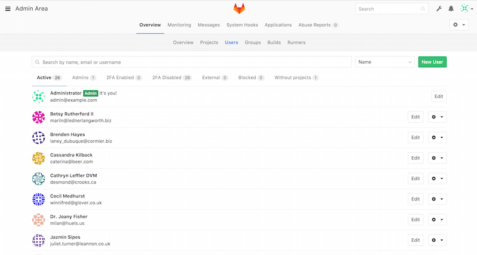

# Git auf dem Server

 An dieser
Stelle sollten Sie in der Lage sein, die meisten der täglichen Aufgaben
zu erledigen, für die Sie Git verwenden werden. Um jedoch in Git
zusammenarbeiten zu können, benötigen Sie ein externes Git-Repository.
Obwohl Sie, technisch gesehen, Änderungen an und aus den individuellen
Repositorys verschieben können, ist das nicht empfehlenswert, da Sie
sich ziemlich leicht irren könnten, woran sie arbeiten, wenn Sie nicht
vorsichtig sind. Darüber hinaus ist es vorteilhaft, dass Ihre
Mitarbeiter auch dann auf das Repository zugreifen können, wenn Ihr
Computer offline ist – ein zuverlässigeres gemeinsames Repository ist
oft sinnvoll. Daher ist die bevorzugte Methode für die Zusammenarbeit,
einen Zwischenspeicher einzurichten, auf den beide Seiten Zugriff haben,
und von dem aus sie Push-to and Pull ausführen können.

Das Betreiben eines Git-Servers ist recht unkompliziert. Zuerst
bestimmen Sie, welche Protokolle Ihr Server unterstützen soll. Der erste
Abschnitt dieses Kapitels behandelt die verfügbaren Protokolle und deren
Vor- und Nachteile. In den nächsten Abschnitten werden einige typische
Setups mit diesen Protokollen erläutert und erklärt, wie Sie Ihren
Server mit diesen Protokollen zum Laufen bringen. Zuletzt werden wir ein
paar gehostete Optionen durchgehen, wenn es Ihnen nichts ausmacht, Ihren
Code auf dem Server eines anderen zu hosten und Sie nicht den Aufwand
der Einrichtung und Wartung Ihres eigenen Servers auf sich nehmen
wollen.

Wenn Sie keinen eigenen Server betreiben möchten, können Sie zum letzten
Abschnitt dieses Kapitels springen, um einige Optionen zum Einrichten
eines gehosteten Kontos zu finden und dann mit dem nächsten Kapitel
fortfahren, in dem die verschiedenen Vor- und Nachteile der Arbeit in
einer verteilten Versionskontrollumgebung erläutert werden.

Ein entferntes Repository ist in der Regel ein *„nacktes Repository“* –
ein Git-Repository, das kein Arbeitsverzeichnis hat. Da das Repository
nur als Kollaborationspunkt verwendet wird, gibt es keinen Grund, einen
Snapshot auf die Festplatte speichern zu lassen; es enthält nur die
Git-(Kontroll-)Daten. Im einfachsten Fall besteht ein nacktes (eng.
bare) Repository aus dem Inhalt des `.git` Verzeichnisses Ihres Projekts
und nichts anderem.

## Die Protokolle

Git kann vier verschiedene Protokolle für die Datenübertragung
verwenden: Lokal, HTTP, Secure Shell (SSH) und Git. Hier werden wir
klären, worum es sich handelt und unter welchen Rahmenbedingungen Sie
sie verwenden könnten (oder nicht sollten).

### Lokales Protokoll

Das einfachste ist das *lokale Protokoll*, bei dem sich das entfernte
Repository in einem anderen Verzeichnis auf demselben Host befindet. Es
wird häufig verwendet, wenn jeder in Ihrem Team Zugriff auf ein
freigegebenes Dateisystem wie z.B. ein
[NFS](https://de.wikipedia.org/wiki/Network_File_System)-Mount hat, oder
in dem selteneren Fall, dass sich jeder auf dem gleichen Computer
anmeldet. Letzteres wäre nicht ideal, da sich alle Ihre
Code-Repository-Instanzen auf demselben Computer befinden würden, was
einen katastrophalen Verlust viel wahrscheinlicher macht.

Wenn Sie ein gemeinsam genutztes gemountetes Dateisystem haben, können
Sie ein lokales dateibasiertes Repository klonen, dort hin verschieben
(engl. push to) und daraus ziehen (engl. pull). Verwenden Sie den Pfad
zum Repository als URL, um ein solches Repository zu klonen oder einem
vorhandenen Projekt ein Remote-Repository hinzuzufügen. Um
beispielsweise ein lokales Repository zu klonen, können Sie Folgendes
ausführen:

    $ git clone /srv/git/project.git

oder auch das:

    $ git clone file:///srv/git/project.git

Git funktioniert etwas anders, wenn Sie `file://` explizit am Anfang der
URL angeben. Wenn Sie nur den Pfad angeben, versucht Git, Hardlinks zu
verwenden oder die benötigten Dateien direkt zu kopieren. Wenn Sie
`file://` angeben, löst Git Prozesse aus, die normalerweise zum
Übertragen von Daten über ein Netzwerk verwendet werden, was im
Allgemeinen viel weniger effizient ist. Der Hauptgrund für die Angabe
des Präfix `file://` ist, wenn Sie eine saubere Kopie des Repositorys
mit fremden Referenzen oder weggelassenen Objekten wünschen – in der
Regel nach einem Import aus einem anderen VCS oder ähnlichem (siehe [Git
Interna](ch10-git-internals.xml#ch10-git-internals) für
Wartungsaufgaben). Wir werden hier den normalen Pfad verwenden, denn das
ist fast immer schneller.

Um ein lokales Repository zu einem bestehenden Git-Projekt hinzuzufügen,
kann so vorgegangen werden:

    $ git remote add local_proj /srv/git/project.git

Dann können Sie über Ihren neuen Remote-Namen `local_proj` auf dieses
Remote-Repository pushen und von dort abrufen, als ob Sie dies über ein
Netzwerk tun würden.

#### Vorteile

Die Vorteile dateibasierter Repositorys liegen darin, dass sie einfach
sind und vorhandene Datei- und Netzwerk-Berechtigungen verwenden. Wenn
Sie bereits über ein freigegebenes Dateisystem verfügen, auf das Ihr
gesamtes Team Zugriff hat, ist das Einrichten eines Repositorys sehr
einfach. Sie speichern die leere Repository-Kopie an einer Stelle, auf
die jeder Zugriff hat, und legen die Lese- und Schreibberechtigungen wie
bei jedem anderen freigegebenen Verzeichnis fest. Informationen zum
Exportieren einer Bare-Repository-Kopie für diesen Zweck finden Sie
unter [Git auf einem Server installieren](#_getting_git_on_a_server).

Das ist auch eine elegante Möglichkeit, um schnell Arbeiten aus dem
Arbeits-Repository eines anderen zu holen. Wenn Sie und ein Mitarbeiter
am gleichen Projekt arbeiten und Sie etwas überprüfen möchten, ist es
oft einfacher, einen Befehl wie `git pull /home/john/project`
auszuführen, als auf einen Remote-Server zu pushen und anschließend von
dort zu holen.

#### Nachteile

Der Nachteil dieser Methode ist, dass der gemeinsame Zugriff in der
Regel schwieriger einzurichten ist damit man von mehreren Standorten aus
erreichbar ist als der einfache Netzwerkzugriff. Wenn Sie von zu Hause
mit Ihrem Laptop aus pushen möchten, müssen Sie das entfernte
Verzeichnis einhängen (engl. mounten), was im Vergleich zum
netzwerkbasierten Zugriff schwierig und langsamer sein kann.

Es ist wichtig zu erwähnen, dass es nicht unbedingt die schnellste
Option ist, wenn Sie einen gemeinsamen Mount verwenden. Ein lokales
Repository ist nur dann schnell, wenn Sie schnellen Zugriff auf die
Daten haben. Ein Repository auf NFS-Mounts ist oft langsamer als der
Zugriff auf das Repository über SSH auf demselben Server, während Git
lokale Festplatten in jedem System nutzt.

Schließlich schützt dieses Protokoll das Repository nicht vor
unbeabsichtigten Schäden. Jeder Benutzer hat vollen Shell-Zugriff auf
das „remote“ Verzeichnis, und nichts hindert ihn daran, interne
Git-Dateien zu ändern oder zu entfernen und das Repository zu
beschädigen.

### HTTP Protokolle

Git kann über HTTP in zwei verschiedenen Modi kommunizieren. Vor Git
1.6.6 gab es nur einen einzigen Weg, der sehr einfach und im Allgemeinen
„read-only“ war. Mit der Version 1.6.6 wurde ein neues, intelligenteres
Protokoll eingeführt, bei dem Git in der Lage ist, den Datentransfer
intelligent auszuhandeln, ähnlich wie bei SSH. In den letzten Jahren ist
dieses neue HTTP-Protokoll sehr beliebt geworden, da es für den Benutzer
einfacher und intelligenter in der Kommunikation ist. Die neuere Version
wird oft als *Smart* HTTP Protokoll und die ältere als *Dumb* HTTP
bezeichnet. Wir werden zuerst das neuere Smart HTTP-Protokoll
besprechen.

#### Smart HTTP

 Smart HTTP funktioniert sehr ähnlich wie
die Protokolle SSH oder Git, läuft aber über Standard HTTPS-Ports und
kann verschiedene HTTP-Authentifizierungsmechanismen verwenden, was
bedeutet, dass es für den Benutzer oft einfacher ist als so etwas wie
SSH, da Sie Eingaben wie Benutzername/Passwort-Authentifizierung
verwenden können, anstatt SSH-Schlüssel einrichten zu müssen.

Es ist wahrscheinlich der beliebteste Weg, heute Git zu verwenden, da es
so eingerichtet werden kann, dass es sowohl anonym wie das Protokoll
`git://` arbeitet, als auch mit Authentifizierung und Verschlüsselung
wie das SSH-Protokoll betrieben werden kann. Anstatt dafür verschiedene
URLs einrichten zu müssen, können Sie nun eine einzige URL für beides
verwenden. Wenn Sie versuchen, einen Push durchzuführen und das
Repository eine Authentifizierung erfordert (was normalerweise der Fall
sein sollte), kann der Server nach einem Benutzernamen und einem
Passwort fragen. Gleiches gilt für den Lesezugriff.

Für Dienste, wie GitHub, ist die URL, die Sie verwenden, um das
Repository online anzuzeigen (z.B.
<https://github.com/schacon/simplegit>), die gleiche URL, mit der Sie
klonen und, wenn Sie Zugriff haben, dorthin pushen können.

#### Dumb HTTP

 Wenn der Server nicht mit einem Git HTTP
Smart Service antwortet, versucht der Git Client, auf das einfachere
*Dumb* HTTP Protokoll zurückzugreifen. Das Dumb-Protokoll erwartet von
dem Bare-Git-Repository, dass es vom Webserver wie normale Dateien
behandelt wird. Das Schöne an Dumb HTTP ist die Einfachheit der
Einrichtung. Im Grunde genommen müssen Sie nur ein leeres Git-Repository
unter Ihre HTTP-Dokument-Root legen und einen bestimmten `post-update`
Hook einrichten, und schon sind Sie fertig (siehe [Git
Hooks](ch08-customizing-git.xml#_git_hooks)). Ab diesem Zeitpunkt kann
jeder, der auf den Webserver zugreifen kann, unter dem Sie das
Repository ablegen, auch Ihr Repository klonen. Um Lesezugriff auf Ihr
Repository über HTTP zu ermöglichen, gehen Sie wie folgt vor:

    $ cd /var/www/htdocs/
    $ git clone --bare /path/to/git_project gitproject.git
    $ cd gitproject.git
    $ mv hooks/post-update.sample hooks/post-update
    $ chmod a+x hooks/post-update

Das war’s. Der `post-update` Hook, der
standardmäßig mit Git geliefert wird, führt den entsprechenden Befehl
(`git update-server-info`) aus, um das HTTP-Abrufen und -Kloning
ordnungsgemäß zu ermöglichen. Dieser Befehl wird ausgeführt, wenn Sie in
dieses Repository pushen (vielleicht über SSH); dann können andere Leute
klonen über so etwas wie:

    $ git clone https://example.com/gitproject.git

In diesem speziellen Fall verwenden wir den Pfad `/var/www/htdocs`, der
für Apache-Installationen üblich ist, Sie können aber jeden statischen
Webserver verwenden – legen Sie einfach das leere Repository in seinen
Pfad. Die Git-Daten werden als einfache statische Dateien bereitgestellt
(siehe Kapitel [Git Interna](ch10-git-internals.xml#ch10-git-internals)
für Bedienungsdetails).

Im Allgemeinen würden Sie sich entweder einen Smart HTTP-Server zum
Lesen und Schreiben betreiben oder die Dateien einfach als
schreibgeschützt im Dumb-Modus zur Verfügung stellen. Seltener wird ein
Mix aus beiden Diensten angeboten.

#### Vorteile

Wir werden uns auf die Vorteile der Smart Version des HTTP-Protokolls
konzentrieren.

Die Tatsache, dass eine einzige URL für alle Zugriffsarten und der
Server-Prompt nur dann gebraucht wird, wenn eine Authentifizierung
erforderlich ist, macht die Sache für den Endbenutzer sehr einfach. Die
Authentifizierung mit einem Benutzernamen und einem Passwort ist
ebenfalls ein großer Vorteil gegenüber SSH, da Benutzer keine
SSH-Schlüssel lokal generieren und ihren öffentlichen Schlüssel auf den
Server hochladen müssen, bevor sie mit ihm interagieren können. Für
weniger anspruchsvolle Benutzer oder Benutzer auf Systemen, auf denen
SSH weniger verbreitet ist, ist dies ein großer Vorteil in der
Benutzerfreundlichkeit. Es ist auch ein sehr schnelles und effizientes
Protokoll, ähnlich dem SSH-Protokoll.

Sie können Ihre Repositorys auch schreibgeschützt über HTTPS
bereitstellen, d.h. Sie können die Inhaltsübertragung verschlüsseln oder
Sie können sogar so weit gehen, dass Clients bestimmte signierte
SSL-Zertifikate verwenden müssen.

Eine weitere schöne Sache ist, dass HTTP und HTTPS ein so häufig
verwendetes Protokoll ist, dass Unternehmens-Firewalls oft so
eingerichtet sind, dass sie den Datenverkehr über deren Ports
ermöglichen.

#### Nachteile

Git über HTTPS kann im Vergleich zu SSH auf einigen Servern etwas
komplizierter einzurichten sein. Abgesehen davon gibt es sehr wenig
Vorteile, die andere Protokolle gegenüber Smart HTTP für die
Bereitstellung von Git-Inhalten haben.

Wenn Sie HTTP für authentifiziertes Pushen verwenden, ist die
Bereitstellung Ihrer Anmeldeinformationen manchmal komplizierter als die
Verwendung von Schlüsseln über SSH. Es gibt jedoch mehrere Tools zum
Zwischenspeichern von Berechtigungen, die Sie verwenden könnten,
darunter Keychain-Zugriff auf macOS und Credential Manager unter
Windows, um das ziemlich zu Vereinfachen. Lesen Sie den Abschnitt
[Credential Storage](ch07-git-tools.xml#_credential_caching), um zu
erfahren, wie Sie ein sicheres HTTP-Passwort-Caching auf Ihrem System
einrichten können.

### SSH Protocol

 Ein
gängiges Transportprotokoll für Git, wenn das Self-Hosting über SSH
erfolgt. Der SSH-Zugriff auf den Server ist in den meisten Fällen
bereits eingerichtet – und wenn nicht, ist es einfach zu
bewerkstelligen. SSH ist auch ein authentifiziertes Netzwerkprotokoll,
und da es allgegenwärtig ist, ist es im Allgemeinen einfach einzurichten
und zu verwenden.

Um ein Git-Repository über SSH zu klonen, können Sie eine entsprechende
`ssh://` URL angeben:

    $ git clone ssh://[user@]server/project.git

Oder Sie können die kürzere scp-ähnliche Syntax für das SSH-Protokoll
verwenden:

    $ git clone [user@]server:project.git

Wenn Sie in beiden Fällen oben keinen optionalen Benutzernamen angeben,
benutzt Git den User, mit dem Sie aktuell angemeldet sind.

#### Vorteile

Die Vorteile bei der Verwendung von SSH sind vielfältig. Erstens ist SSH
relativ einfach einzurichten – SSH-Daemons sind weit verbreitet, viele
Netzwerkadministratoren haben Erfahrung mit ihnen und viele
Betriebssystem-Distributionen werden mit ihnen eingerichtet oder haben
Werkzeuge, um sie zu verwalten. Als nächstes ist der Zugriff über SSH
sicher – der gesamte Datentransfer wird verschlüsselt und
authentifiziert. Schließlich ist SSH, wie die Protokolle HTTPS, Git und
Local effizient und komprimiert die Daten vor der Übertragung so stark
wie möglich.

#### Nachteile

Die negative Seite von SSH ist, dass es keinen anonymen Zugriff auf Ihr
Git-Repository unterstützt. Wenn Sie SSH verwenden, *müssen* Benutzer
über einen SSH-Zugriff auf Ihren Computer verfügen, auch wenn sie nur
über Lesezugriff verfügen. Das macht SSH in Open Source-Projekten
ungeeignet, wenn, möglicherweise, die Benutzer Ihr Repository einfach
nur klonen möchten, um es zu überprüfen. Wenn Sie es nur in Ihrem
Unternehmensnetzwerk verwenden, ist SSH möglicherweise das einzige
Protokoll, mit dem Sie sich befassen müssen. Wenn Sie anonymen
schreibgeschützten Zugriff auf Ihre Projekte und die Verwendung von SSH
zulassen möchten, müssen Sie SSH einrichten, damit Sie Push-Vorgänge
ausführen können, aber noch zusätzliche Optionen damit andere Benutzer
auch abrufen können.

### Git Protokoll

 Und
schließlich haben wir das Git-Protokoll. Es ist ein spezieller Daemon,
der mit Git ausgeliefert wird, der auf einem dedizierten Port (9418)
lauscht und der einen Dienst bereitstellt, ähnlich dem des
SSH-Protokolls, aber ohne jegliche Authentifizierung oder
Verschlüsselung. Damit ein Repository über das Git-Protokoll bedient
werden kann, müssen Sie eine `git-daemon-export-ok` Datei erstellen –
der Daemon wird ohne diese Datei kein Repository bedienen, weil es sonst
keine Sicherheit gibt. Entweder ist das Git-Repository für jeden
zugänglich, um zu klonen, oder für keinen. Das bedeutet, dass es in der
Regel keinen Push über dieses Protokoll gibt. Sie können den
Push-Zugriff aktivieren, aber angesichts der fehlenden Authentifizierung
kann jeder im Internet, der die URL Ihres Projekts findet, zu diesem
Projekt pushen. Es reicht aus, zu sagen, dass das selten vorkommt.

#### Vorteile

Das Git-Protokoll ist oft als erstes Netzwerkübertragungsprotokoll
verfügbar. Wenn Sie viel Traffic für ein öffentliches Projekt
bereitstellen oder ein sehr großes Projekt, das keine
Benutzerauthentifizierung für den Lesezugriff benötigt, dann wollen Sie
voraussichtlich einen Git-Daemon einrichten, der Ihr Projekt
unterstützt. Er verwendet den gleichen Datenübertragungsmechanismus wie
das SSH-Protokoll, jedoch ohne den Aufwand für Verschlüsselung und
Authentifizierung.

#### Nachteile

Aufgrund des Fehlens von TLS oder einer anderer Verschlüsselung kann das
Klonen über „git://“ zu der Schwachstelle der Ausführung willkürlichen
Codes führen und sollte daher vermieden werden, es sei denn, Sie wissen,
was Sie tun.

-   Wenn Sie `git clone git://example.com/project.git` ausführen, kann
    ein Angreifer, der z. B. Ihren Router kontrolliert, das gerade
    geklonte Repo modifizieren und bösartigen Code injizieren. Wenn Sie
    dann den gerade geklonten Code kompilieren/ausführen, führen Sie
    diesen bösartigen Code aus. Das Ausführen von
    `git clone http://example.com/project.git` sollte aus demselben
    Grund vermieden werden.

-   Das Ausführen von `git clone https://example.com/project.git` leidet
    nicht unter dem gleichen Problem (es sei denn, der Angreifer kann
    ein TLS-Zertifikat für example.com bereitstellen). Das Ausführen von
    `git clone git@example.com:project.git` leidet nur unter diesem
    Problem, wenn Sie einen falschen ssh-key fingerprint akzeptieren.

Es hat auch keine Authentifizierung, d.h. jeder kann das Repo klonen
(obwohl dies oft genau das ist, was Sie wollen). Es ist wahrscheinlich
auch das am schwierigsten einzurichtende Protokoll. Es muss seinen
eigenen Daemon laufen lassen, der eine `xinetd` oder `systemd`
Konfiguration oder dergleichen erfordert, was nicht immer ein
Park-Spaziergang ist. Es erfordert auch einen Firewall-Zugang auf Port
9418, der kein Standardport ist, den Unternehmens-Firewalls immer
zulassen. Hinter großen Firmen-Firewalls wird dieser „obskure“ Port
häufig blockiert.

## Git auf einem Server einrichten

Nun geht es darum, einen Git-Dienst einzurichten, der diese Protokolle
auf Ihrem eigenen Server ausführt.

Hier zeigen wir Ihnen die Befehle und Schritte, die für die
grundlegende, vereinfachte Installation auf einem Linux-basierten Server
erforderlich sind, aber es ist auch möglich, diese Dienste auf macOS-
oder Windows-Servern auszuführen. Die tatsächliche Einrichtung eines
Produktionsservers innerhalb Ihrer Infrastruktur wird sicherlich
Unterschiede in Bezug auf Sicherheitsmaßnahmen oder
Betriebssystemwerkzeuge mit sich bringen, aber hoffentlich gibt Ihnen
das hier einen Überblick darüber, worum es geht.

Um einen Git-Server einzurichten, müssen Sie ein bestehendes Repository
in ein neues Bare-Repository exportieren – ein Repository, das kein
Arbeitsverzeichnis enthält. Das ist im Allgemeinen einfach zu
realisieren. Um Ihr Repository zu klonen, um ein neues leeres Repository
zu erstellen, führen Sie den Befehl clone mit der Option `--bare`
aus. Normalerweise enden
Bare-Repository-Verzeichnisnamen mit dem Suffix `.git`, wie hier:

    $ git clone --bare my_project my_project.git
    Cloning into bare repository 'my_project.git'...
    done.

Sie sollten nun eine Kopie der Git-Verzeichnisdaten in Ihrem
`my_project.git` Verzeichnis haben.

Das ist ungefähr so etwas wie:

    $ cp -Rf my_project/.git my_project.git

Es gibt ein paar kleine Unterschiede in der Konfigurationsdatei, aber
für Ihren Zweck ist das fast dasselbe. Es übernimmt das Git-Repository
allein, ohne Arbeitsverzeichnis, und erstellt daraus ein eigenes
Verzeichnis.

### Das Bare-Repository auf einem Server ablegen

Jetzt, da Sie eine leere Kopie Ihres Repositorys haben, müssen Sie es
nur noch auf einen Server legen und Ihre Protokolle einrichten. Nehmen
wir an, Sie haben einen Server mit der Bezeichnung `git.example.com`
eingerichtet, auf den Sie SSH-Zugriff haben und Sie möchten alle Ihre
Git-Repositorys unter dem Verzeichnis `/srv/git` speichern. Angenommen,
`/srv/git` existiert bereits auf diesem Server, dann können Sie Ihr
neues Repository einrichten, indem Sie Ihr leeres Repository kopieren:

    $ scp -r my_project.git user@git.example.com:/srv/git

Ab diesem Zeitpunkt können andere Benutzer, die SSH-basierten
Lesezugriff auf das Verzeichnis `/srv/git` auf diesem Server haben, Ihr
Repository klonen, indem sie Folgendes ausführen:

    $ git clone user@git.example.com:/srv/git/my_project.git

Wenn sich ein Benutzer über SSH in einen Server einloggt und
Schreibrechte auf das Verzeichnis `/srv/git/my_project.git` hat, hat er
auch automatisch Push-Rechte.

Git fügt automatisch Schreibrechte für Gruppen zu einem Repository
hinzu, wenn Sie den Befehl `git init` mit der Option `--shared`
ausführen. Beachten Sie, dass Sie durch die Ausführung dieses Befehls
keine Commits, Referenzen usw. im laufenden Prozess zerstören
werden.

    $ ssh user@git.example.com
    $ cd /srv/git/my_project.git
    $ git init --bare --shared

Sie sehen, wie einfach es ist, ein Git-Repository zu übernehmen, eine
leere Version zu erstellen und sie auf einem Server zu platzieren, auf
den Sie und Ihre Mitarbeiter SSH-Zugriff haben. Jetzt sind Sie in der
Lage, am gleichen Projekt mitzuarbeiten.

Es ist wichtig zu wissen, dass dies buchstäblich alles ist, was Sie tun
müssen, um einen brauchbaren Git-Server zu betreiben, auf den mehrere
Personen Zugriff haben – fügen Sie einfach SSH-fähige Konten auf einem
Server hinzu und legen Sie ein leeres Repository an einen Ort, auf das
alle diese Benutzer Lese- und Schreibrechte haben. Sie sind startklar –
mehr ist nicht nötig.

In den nächsten Abschnitten erfahren Sie, wie Sie das zu komplexeren
Konfigurationen erweitern können. Diese Betrachtung beinhaltet, dass man
nicht für jeden Benutzer ein Benutzerkonto anlegen muss, öffentlichen
Lesezugriff auf Repositorys hinzufügen und Web-UIs einrichten kann und
vieles mehr. Denken Sie jedoch daran, dass zur Zusammenarbeit mit ein
paar Personen bei einem privaten Projekt *nur* ein SSH-Server und ein
Bare-Repository benötigt wird.

### Kleine Installationen

Wenn Sie ein kleines Team sind, Git nur in Ihrer Umgebung ausprobieren
wollen und nur wenige Entwickler haben, kann es ganz einfach sein. Einer
der kompliziertesten Aspekte bei der Einrichtung eines Git-Servers ist
die Benutzerverwaltung. Wenn Sie möchten, dass einige Repositorys für
bestimmte Benutzer schreibgeschützt und für andere lesend und schreibend
sind, können Zugriff und Berechtigungen etwas schwieriger zu realisieren
sein.

#### SSH-Zugang

Wenn Sie einen Server haben, auf dem alle Ihre Entwickler bereits
SSH-Zugriff haben, ist es in der Regel am einfachsten, dort Ihr erstes
Repository einzurichten, da Sie so gut wie keine zusätzlichen
Einstellungen vornehmen müssen (wie wir im letzten Abschnitt beschrieben
haben). Wenn Sie komplexere Zugriffsberechtigungen für Ihre Repositorys
benötigen, können Sie diese mit den normalen Dateisystemberechtigungen
des Betriebssystems Ihres Servers verwalten.

Wenn Sie Ihre Repositorys auf einem Server platzieren möchten, der nicht
über Konten für alle Personen in Ihrem Team verfügt, denen Sie
Schreibzugriff gewähren möchten, müssen Sie für sie einen SSH-Zugriff
einrichten. Wir gehen davon aus, dass auf Ihrem Server bereits ein
SSH-Server installiert ist und Sie auf diesen Server zugreifen können.

Es gibt einige Möglichkeiten, wie Sie jedem in Ihrem Team Zugang
gewähren können. Die erste besteht darin, Konten für alle einzurichten,
was unkompliziert ist, aber schwerfällig sein kann. Unter Umständen ist
es ratsam, `adduser` (oder die mögliche Alternative `useradd`) nicht
auszuführen und für jeden neuen Benutzer temporäre Passwörter
festzulegen.

Eine zweite Methode besteht darin, ein einzelnes Git-Benutzerkonto auf
der Maschine zu erstellen, jeden Benutzer, der Schreibrechte haben soll,
aufzufordern, Ihnen einen öffentlichen SSH-Schlüssel zu senden, und
diesen Schlüssel zur Datei `~/.ssh/authorized_keys` dieses neuen
Git-Kontos hinzuzufügen. Zu dem Zeitpunkt kann jeder über das Git-Konto
auf diese Maschine zugreifen. Das hat keinen Einfluss auf die
Commit-Daten – den SSH-Benutzer, den Sie anmelden, und auch nicht auf
die Commits, die Sie gespeichert haben.

Eine weitere Möglichkeit besteht darin, dass sich Ihr SSH-Server von
einem LDAP-Server oder einer anderen zentralen Authentifizierungsquelle
authentifiziert, die Sie möglicherweise bereits eingerichtet haben.
Solange jeder Benutzer Shell-Zugriff auf die Maschine erhalten kann,
sollte jeder denkbare SSH-Authentifizierungsmechanismus funktionieren.

## Erstellung eines SSH-Public-Keys

 Viele Git-Server authentifizieren sich
über öffentliche SSH-Schlüssel. Um einen öffentlichen Schlüssel
bereitzustellen, muss jeder Benutzer in Ihrem System selbst einen
generieren, falls er noch keinen hat. Der Ablauf ist für alle
Betriebssysteme gleich. Zuerst sollten Sie überprüfen, ob Sie noch
keinen Schlüssel haben. Standardmäßig werden die SSH-Schlüssel eines
Benutzers im Verzeichnis `~/.ssh` dieses Benutzers gespeichert. Sie
können leicht nachsehen, ob Sie bereits über einen Schlüssel verfügen,
indem Sie in dieses Verzeichnis gehen und den Inhalt auflisten:

    $ cd ~/.ssh
    $ ls
    authorized_keys2  id_dsa       known_hosts
    config            id_dsa.pub

Suchen Sie ein Datei-Paar mit dem Namen `id_dsa` oder `id_rsa` und eine
entsprechende Datei mit der Erweiterung `.pub`. Die `.pub` Datei ist Ihr
öffentlicher Schlüssel, und die andere Datei ist der zugehörige private
Schlüssel. Wenn Sie diese Dateien nicht haben (oder nicht einmal ein
`.ssh` Verzeichnis vorhanden ist), können Sie sie erstellen, indem Sie
ein Programm namens `ssh-keygen` ausführen, das im SSH-Paket auf
Linux/macOS-Systemen enthalten ist und mit Git für Windows installiert
wird:

    $ ssh-keygen -o
    Generating public/private rsa key pair.
    Enter file in which to save the key (/home/schacon/.ssh/id_rsa):
    Created directory '/home/schacon/.ssh'.
    Enter passphrase (empty for no passphrase):
    Enter same passphrase again:
    Your identification has been saved in /home/schacon/.ssh/id_rsa.
    Your public key has been saved in /home/schacon/.ssh/id_rsa.pub.
    The key fingerprint is:
    d0:82:24:8e:d7:f1:bb:9b:33:53:96:93:49:da:9b:e3 schacon@mylaptop.local

Zuerst wird der Speicherort des Schlüssels (`.ssh/id_rsa`) festgelegt,
danach wird zweimal nach einer Passphrase gefragt, die Sie leer lassen
können, wenn Sie beim Verwenden des Schlüssels kein Passwort eingeben
möchten. Wenn Sie jedoch ein Passwort verwenden, fügen Sie die Option
`-o` hinzu; sie speichert den privaten Schlüssel in einem Format, das
resistenter gegen Brute-Force-Passwortcracking ist als das
Standardformat. Sie können auch das `ssh-agent` Tool verwenden, um zu
vermeiden, dass Sie das Passwort jedes Mal neu eingeben müssen.

Jetzt muss jeder Benutzer seinen öffentlichen Schlüssel an Sie oder an
einen Administrator des Git-Servers senden (vorausgesetzt, Sie verwenden
ein SSH-Server-Setup, für das öffentliche Schlüssel erforderlich sind).
Alles, was man tun muss, ist, den Inhalt der `.pub` Datei zu kopieren
und per E-Mail zu versenden. Die öffentlichen Schlüssel sehen in etwa so
aus:

    $ cat ~/.ssh/id_rsa.pub
    ssh-rsa AAAAB3NzaC1yc2EAAAABIwAAAQEAklOUpkDHrfHY17SbrmTIpNLTGK9Tjom/BWDSU
    GPl+nafzlHDTYW7hdI4yZ5ew18JH4JW9jbhUFrviQzM7xlELEVf4h9lFX5QVkbPppSwg0cda3
    Pbv7kOdJ/MTyBlWXFCR+HAo3FXRitBqxiX1nKhXpHAZsMciLq8V6RjsNAQwdsdMFvSlVK/7XA
    t3FaoJoAsncM1Q9x5+3V0Ww68/eIFmb1zuUFljQJKprrX88XypNDvjYNby6vw/Pb0rwert/En
    mZ+AW4OZPnTPI89ZPmVMLuayrD2cE86Z/il8b+gw3r3+1nKatmIkjn2so1d01QraTlMqVSsbx
    NrRFi9wrf+M7Q== schacon@mylaptop.local

Ein ausführliches Tutorial zur Erstellung eines SSH-Schlüssels für
unterschiedliche Betriebssysteme finden Sie in der GitHub-Anleitung für
SSH-Schlüssel unter [Generieren und Hinzufügen eines
SSH-Schlüssels](https://docs.github.com/de/github/authenticating-to-github/generating-a-new-ssh-key-and-adding-it-to-the-ssh-agent).

## Einrichten des Servers

Lassen Sie uns durch die Einrichtung des SSH-Zugriffs auf der
Serverseite gehen. In diesem Beispiel verwenden Sie die Methode
`authorized_keys` zur Authentifizierung Ihrer Benutzer. Wir nehmen an,
dass Sie eine Standard-Linux-Distribution wie Ubuntu verwenden.

Viele der hier beschriebenen Vorgänge können mit dem Befehl
`ssh-copy-id` automatisiert werden, ohne dass öffentliche Schlüssel
manuell kopiert und installiert werden müssen.

Zuerst erstellen Sie ein `git` Benutzerkonto und ein `.ssh` Verzeichnis
für diesen Benutzer:

    $ sudo adduser git
    $ su git
    $ cd
    $ mkdir .ssh && chmod 700 .ssh
    $ touch .ssh/authorized_keys && chmod 600 .ssh/authorized_keys

Als nächstes müssen Sie einige öffentliche SSH-Schlüssel für Entwickler
zur `authorized_keys` Datei für den `git` User hinzufügen. Nehmen wir
an, Sie haben einige vertrauenswürdige öffentliche Schlüssel und haben
sie in temporären Dateien gespeichert. Auch hier sehen die öffentlichen
Schlüssel in etwa so aus:

    $ cat /tmp/id_rsa.john.pub
    ssh-rsa AAAAB3NzaC1yc2EAAAADAQABAAABAQCB007n/ww+ouN4gSLKssMxXnBOvf9LGt4L
    ojG6rs6hPB09j9R/T17/x4lhJA0F3FR1rP6kYBRsWj2aThGw6HXLm9/5zytK6Ztg3RPKK+4k
    Yjh6541NYsnEAZuXz0jTTyAUfrtU3Z5E003C4oxOj6H0rfIF1kKI9MAQLMdpGW1GYEIgS9Ez
    Sdfd8AcCIicTDWbqLAcU4UpkaX8KyGlLwsNuuGztobF8m72ALC/nLF6JLtPofwFBlgc+myiv
    O7TCUSBdLQlgMVOFq1I2uPWQOkOWQAHukEOmfjy2jctxSDBQ220ymjaNsHT4kgtZg2AYYgPq
    dAv8JggJICUvax2T9va5 gsg-keypair

Sie fügen sie einfach an die Datei `authorized_keys` des `git` Benutzers
in dessen `.ssh` Verzeichnis an:

    $ cat /tmp/id_rsa.john.pub >> ~/.ssh/authorized_keys
    $ cat /tmp/id_rsa.josie.pub >> ~/.ssh/authorized_keys
    $ cat /tmp/id_rsa.jessica.pub >> ~/.ssh/authorized_keys

Nun können Sie ein leeres Repository für sie einrichten, indem Sie
`git init` mit der Option `--bare` ausführen, die das Repository ohne
Arbeitsverzeichnis initialisiert:

    $ cd /srv/git
    $ mkdir project.git
    $ cd project.git
    $ git init --bare
    Initialized empty Git repository in /srv/git/project.git/

Dann können John, Josie oder Jessica die erste Version ihres Projekts in
dieses Repository pushen, indem sie es als Remote hinzufügen und dann
einen Branch pushen. Beachten Sie, dass jemand auf der Maschine eine
Shell ausführen muss und jedes Mal, wenn Sie ein Projekt hinzufügen
möchten, ein Bare-Repository erstellen muss. Lassen Sie uns `gitserver`
als Hostname für den Server verwenden, auf dem Sie Ihren `git` Benutzer
und Ihr Repository eingerichtet haben. Wenn Sie das intern ausführen und
DNS so einrichten, dass `gitserver` auf diesen Server zeigt, dann können
Sie die Befehle so verwenden, wie sie sind (vorausgesetzt, dass
`myproject` ein bestehendes Projekt mit Dateien darin ist):

    # on John's computer
    $ cd myproject
    $ git init
    $ git add .
    $ git commit -m 'Initial commit'
    $ git remote add origin git@gitserver:/srv/git/project.git
    $ git push origin master

Jetzt können die anderen es klonen und Änderungen genauso einfach wieder
pushen:

    $ git clone git@gitserver:/srv/git/project.git
    $ cd project
    $ vim README
    $ git commit -am 'Fix for README file'
    $ git push origin master

Mit dieser Methode können Sie schnell einen Read/Write Git-Server für
eine Handvoll Entwickler in Betrieb nehmen.

Sie sollten beachten, dass sich derzeit alle diese Benutzer auch am
Server anmelden und eine Shell als `git` Benutzer erhalten können. Wenn
Sie das einschränken wollen, müssen Sie die Shell zu etwas anderem in
der Datei `/etc/passwd` ändern.

Sie können das `git` Benutzerkonto mit einem in Git enthaltenen
Shell-Tool mit dem Namen `git-shell` ganz einfach auf Git-bezogene
Aktivitäten beschränken. Wenn Sie diese Option als Anmeldeshell des
`git` Benutzerkontos festlegen, kann dieses Konto keinen normalen
Shell-Zugriff auf Ihren Server haben. Um das zu nutzen, geben Sie
`git-shell` anstelle von `bash` oder `csh` für die Login-Shell dieses
Kontos an. Um das zu erreichen, müssen Sie zuerst den vollständigen
Pfadnamen des `git-shell` Befehls zu `/etc/shells` hinzufügen, falls er
nicht bereits vorhanden ist:

    $ cat /etc/shells   # see if git-shell is already in there.  If not...
    $ which git-shell   # make sure git-shell is installed on your system.
    $ sudo -e /etc/shells  # and add the path to git-shell from last command

Jetzt können Sie die Shell für einen Benutzer mit
`chsh <username> -s <shell>` bearbeiten:

    $ sudo chsh git -s $(which git-shell)

Nun kann der `git` Benutzer die SSH-Verbindung weiterhin zum Pushen und
Pullen von Git-Repositorys verwenden, aber nicht mehr auf der Maschine
navigieren. Wenn Sie es versuchen, sehen Sie eine entsprechende
Zurückweisung des Logins:

    $ ssh git@gitserver
    fatal: Interactive git shell is not enabled.
    hint: ~/git-shell-commands should exist and have read and execute access.
    Connection to gitserver closed.

An dieser Stelle können Benutzer noch die SSH-Portforwarding verwenden,
um auf jeden Host zuzugreifen, den der Git-Server erreichen kann. Wenn
Sie dies verhindern möchten, können Sie die Datei `authorized_keys`
bearbeiten und jedem Schlüssel, den Sie einschränken möchten, die
folgenden Optionen voranstellen:

    no-port-forwarding,no-X11-forwarding,no-agent-forwarding,no-pty

Das Ergebnis sollte so aussehen:

    $ cat ~/.ssh/authorized_keys
    no-port-forwarding,no-X11-forwarding,no-agent-forwarding,no-pty ssh-rsa
    AAAAB3NzaC1yc2EAAAADAQABAAABAQCB007n/ww+ouN4gSLKssMxXnBOvf9LGt4LojG6rs6h
    PB09j9R/T17/x4lhJA0F3FR1rP6kYBRsWj2aThGw6HXLm9/5zytK6Ztg3RPKK+4kYjh6541N
    YsnEAZuXz0jTTyAUfrtU3Z5E003C4oxOj6H0rfIF1kKI9MAQLMdpGW1GYEIgS9EzSdfd8AcC
    IicTDWbqLAcU4UpkaX8KyGlLwsNuuGztobF8m72ALC/nLF6JLtPofwFBlgc+myivO7TCUSBd
    LQlgMVOFq1I2uPWQOkOWQAHukEOmfjy2jctxSDBQ220ymjaNsHT4kgtZg2AYYgPqdAv8JggJ
    ICUvax2T9va5 gsg-keypair

    no-port-forwarding,no-X11-forwarding,no-agent-forwarding,no-pty ssh-rsa
    AAAAB3NzaC1yc2EAAAADAQABAAABAQDEwENNMomTboYI+LJieaAY16qiXiH3wuvENhBG...

Jetzt funktionieren die Git-Netzwerkbefehle weiterhin einwandfrei, aber
die Benutzer können keine Shell abrufen. Wie in der Ausgabe angegeben,
können Sie auch ein Verzeichnis im Ausgangsverzeichnis des `git`
Benutzers einrichten, das den `git-shell` Befehl ein wenig anpasst. Sie
können beispielsweise die vom Server akzeptierten Git-Befehle
einschränken oder die Nachricht anpassen, die Benutzer sehen, wenn sie
versuchen, SSH auf diese Weise auszuführen. Führen Sie `git help shell`
aus, um weitere Informationen zum Anpassen der Shell zu
erhalten.

## Git-Daemon

 Als Nächstes richten wir einen Daemon
ein, der Repositorys mit dem „Git“-Protokoll versorgt. Das ist eine
gängige Option für den schnellen, nicht authentifizierten Zugriff auf
Ihre Git-Daten. Denken Sie daran, dass alles, was Sie über dieses
Protokoll bereitstellen, innerhalb des Netzwerks öffentlich ist, da dies
kein authentifizierter Dienst ist.

Wenn Sie Git auf einem Server außerhalb Ihrer Firewall ausführen, sollte
dies nur für Projekte verwendet werden, die für die Welt öffentlich
sichtbar sein dürfen. Wenn sich der Server, auf dem Sie es ausführen,
hinter Ihrer Firewall befindet, können Sie es für Projekte verwenden,
auf die eine große Anzahl von Personen oder Computern (Continuous
Integration oder Build-Server) nur Lesezugriff haben, wenn Sie nicht für
jeden einen SSH-Schlüssel hinzufügen möchten.

In jedem Fall ist das Git-Protokoll relativ einfach einzurichten.
Grundsätzlich müssen Sie diesen Befehl daemonisiert
ausführen:

    $ git daemon --reuseaddr --base-path=/srv/git/ /srv/git/

Mit der `--reuseaddr` Option kann der Server neu gestartet werden, ohne
dass das Zeitlimit für alte Verbindungen überschritten wird. Mit der
`--base-path` Option können Benutzer Projekte klonen, ohne den gesamten
Pfad anzugeben. Der Pfad am Ende teilt dem Git-Dämon mit, wo nach zu
exportierenden Repositorys gesucht werden soll. Wenn Sie eine Firewall
verwenden, müssen Sie auch an Port 9418 der Box, auf der Sie diese
einrichten, ein Loch in die Firewall bohren.

Sie können diesen Prozess auf verschiedene Arten dämonisieren, je
nachdem, welches Betriebssystem Sie verwenden.

Da `systemd` das gebräuchlichste Init-System unter modernen
Linux-Distributionen ist, können Sie es für diesen Zweck verwenden.
Legen Sie einfach eine Datei mit folgendem Inhalt in
`/etc/systemd/system/git-daemon.service` ab:

    [Unit]
    Description=Start Git Daemon

    [Service]
    ExecStart=/usr/bin/git daemon --reuseaddr --base-path=/srv/git/ /srv/git/

    Restart=always
    RestartSec=500ms

    StandardOutput=syslog
    StandardError=syslog
    SyslogIdentifier=git-daemon

    User=git
    Group=git

    [Install]
    WantedBy=multi-user.target

Sie haben vielleicht bemerkt, dass der Git-Daemon hier mit `git` als
Gruppe und Benutzer gestartet wird. Passen Sie es an Ihre Bedürfnisse an
und stellen Sie sicher, dass der angegebene Benutzer auf dem System
vorhanden ist. Überprüfen Sie auch, ob sich die Git-Binärdatei
tatsächlich unter `/usr/bin/git` befindet und ändern Sie gegebenenfalls
den Pfad.

Abschließend führen Sie `systemctl enable git-daemon` aus, um den Dienst
beim Booten automatisch zu starten, so dass Sie den Dienst mit
`systemctl start git-daemon` und `systemctl stop git-daemon` starten und
stoppen können.

Auf anderen Systemen können Sie `xinetd` verwenden um ein Skript in
Ihrem `sysvinit` System zu benutzen, oder etwas anderes – solange Sie
diesen Befehl aktiviert und irgendwie überwacht bekommen.

Als nächstes müssen Sie Git mitteilen, auf welche Repositorys nicht
authentifizierter, serverbasierter Zugriff auf Git möglich sein soll.
Sie können das in den einzelnen Repositorys tun, indem Sie eine Datei
mit dem Namen `git-daemon-export-ok` erstellen.

    $ cd /path/to/project.git
    $ touch git-daemon-export-ok

Das Vorhandensein dieser Datei teilt Git mit, dass es in Ordnung ist,
dieses Projekt ohne Authentifizierung zu betreuen.

## Smart HTTP

 Wir haben jetzt authentifizierten Zugriff über
SSH und nicht authentifizierten Zugriff über `git://`, aber es gibt auch
ein Protokoll, das beides gleichzeitig kann. Die Einrichtung von Smart
HTTP ist im Grunde genommen nur die Aktivierung eines CGI-Skripts, das
mit Git namens `git-http-backend` auf dem Server bereitgestellt
wird. Dieses CGI liest den Pfad und die
Header, die von einem `git fetch` oder `git push` an eine HTTP-URL
gesendet werden, und bestimmt, ob der Client über HTTP kommunizieren
kann (was für jeden Client seit Version 1.6.6 gilt). Wenn das CGI sieht,
dass der Client intelligent ist, kommuniziert es intelligent mit ihm;
andernfalls fällt es auf das dumme Verhalten zurück (also ist es
rückwärtskompatibel für Lesezugriffe mit älteren Clients).

Lassen Sie uns durch ein sehr einfaches Setup gehen. Wir werden das mit
Apache als CGI-Server einrichten. Wenn Sie kein Apache-Setup haben,
können Sie dies auf einem Linux-System, wie nachfolgend beschrieben
einrichten:

    $ sudo apt-get install apache2 apache2-utils
    $ a2enmod cgi alias env

Dadurch werden auch die Module `mod_cgi`, `mod_alias`, und `mod_env`
aktiviert, die alle benötigt werden, damit das Ganze ordnungsgemäß
funktioniert.

Sie sollten auch die Unix-Benutzergruppe im Verzeichnis `/srv/git` auf
`www-data` setzen, damit Ihr Webserver auf die Repositorys lesend und
schreibend zugreifen kann, da die Apache-Instanz, auf der das CGI-Skript
läuft, (standardmäßig) als dieser Benutzer ausgeführt wird:

    $ chgrp -R www-data /srv/git

Als nächstes müssen wir der Apache-Konfiguration einige Dinge
hinzufügen, um das `git-http-backend` als Handler für alles, was in den
`/git` Pfad Ihres Webservers kommt, auszuführen.

    SetEnv GIT_PROJECT_ROOT /srv/git
    SetEnv GIT_HTTP_EXPORT_ALL
    ScriptAlias /git/ /usr/lib/git-core/git-http-backend/

Wenn Sie die Umgebungsvariable `GIT_HTTP_EXPORT_ALL` weglassen, wird Git
nur nicht authentifizierten Clients die Repositorys mit der Datei
`git-daemon-export-ok` zur Verfügung stellen, genau wie der Git-Daemon.

Abschließend möchten Sie dem Apache sagen, dass er Anfragen an das
`git-http-backend` zulassen soll, damit Schreibvorgänge irgendwie
authentifiziert werden, möglicherweise mit einem Auth-Block wie diesem:

    <Files "git-http-backend">
        AuthType Basic
        AuthName "Git Access"
        AuthUserFile /srv/git/.htpasswd
        Require expr !(%{QUERY_STRING} -strmatch '*service=git-receive-pack*' || %{REQUEST_URI} =~ m#/git-receive-pack$#)
        Require valid-user
    </Files>

Dazu müssen Sie eine `.htpasswd` Datei erstellen, die die Passwörter
aller gültigen Benutzer enthält. Hier ist ein Beispiel für das
Hinzufügen eines „schacon“ Benutzers zur Datei:

    $ htpasswd -c /srv/git/.htpasswd schacon

Es gibt unzählige Möglichkeiten, Benutzer mit Apache zu
authentifizieren. Sie müssen eine von ihnen auswählen und
implementieren. Das ist nur das einfachste Beispiel, das wir uns
vorstellen können. Sie werden dies auch mit ziemlicher Sicherheit über
SSL konfigurieren wollen, damit alle Daten verschlüsselt werden.

Wir wollen nicht zu weit in das Konzept der
Apache-Konfigurationsspezifikationen eindringen, da Sie möglicherweise
einen anderen Server verwenden oder unterschiedliche
Authentifizierungsanforderungen haben. Die Idee ist, dass Git mit einem
CGI mit dem Namen `git-http-backend` daherkommt, das beim Aufruf alle
Vorbereitungen zum Senden und Empfangen von Daten über HTTP trifft. Es
implementiert selbst keine Authentifizierung, aber diese kann leicht auf
der Ebene des Webservers gesteuert werden, der sie aufruft. Sie können
das mit fast jedem CGI-fähigen Webserver tun, also wählen Sie
denjenigen, den Sie am besten kennen.

Weitere Informationen zur Konfiguration der Authentifizierung in Apache
finden Sie in den Apache-Dokumenten unter:
<https://httpd.apache.org/docs/current/howto/auth.html>

## GitWeb

 Nun, da Sie über einen einfachen
Lese-/Schreibzugriff und Lesezugriff auf Ihr Projekt verfügen, können
Sie einen einfachen webbasierten Visualizer einrichten. Git wird mit
einem CGI-Skript namens GitWeb geliefert, das manchmal dafür verwendet
wird.

<figure id="gitweb">

<figcaption aria-hidden="true">Die webbasierte Benutzeroberfläche von
GitWeb</figcaption>
</figure>

Wenn Sie herausfinden möchten, wie GitWeb für Ihr Projekt aussehen
würde, gibt Git einen Befehl zum Starten einer temporären Instanz, wenn
Sie einen leichten Webserver auf Ihrem System wie `lighttpd` oder
`webrick` haben. Auf Linux-Maschinen wird `lighttpd` oft installiert, so
dass Sie es möglicherweise zum Laufen bringen können, indem Sie
`git instaweb` in Ihr Projektverzeichnis eingeben. Wenn Sie einen Mac
verwenden, wird Leopard mit Ruby vorinstalliert geliefert, so dass
`webrick` Ihre beste Wahl sein kann. Um `instaweb` mit einem
nicht-lighttpd Handler zu starten, können Sie es mit der Option
`--httpd` ausführen.

    $ git instaweb --httpd=webrick
    [2009-02-21 10:02:21] INFO  WEBrick 1.3.1
    [2009-02-21 10:02:21] INFO  ruby 1.8.6 (2008-03-03) [universal-darwin9.0]

Das startet einen HTTPD-Server auf Port 1234 und öffnet ein Webbrowser,
der die Seiter anzeigt. Von ihrer Seite ist dies ziemlich einfach. Wenn
Sie fertig sind und den Server herunterfahren möchten, können Sie den
gleichen Befehl mit der Option `--stop` ausführen:

    $ git instaweb --httpd=webrick --stop

Wenn Sie das Web-Interface die ganze Zeit auf einem Server für Ihr Team
oder für ein Open-Source-Projekt, das Sie hosten, ausführen möchten,
müssen Sie das CGI-Skript so einrichten, dass es von Ihrem normalen
Webserver bedient wird. Einige Linux-Distributionen haben ein `gitweb`
Paket, das Sie möglicherweise über `apt` oder `dnf` installieren können,
so dass Sie das zuerst ausprobieren sollten. Wir werden die manuelle
Installation von GitWeb nur sehr kurz abhandeln. Zuerst müssen Sie den
Git-Quellcode, der im Lieferumfang von GitWeb enthalten ist,
herunterladen und das benutzerdefinierte CGI-Skript generieren:

    $ git clone https://git.kernel.org/pub/scm/git/git.git
    $ cd git/
    $ make GITWEB_PROJECTROOT="/srv/git" prefix=/usr gitweb
        SUBDIR gitweb
        SUBDIR ../
    make[2]: `GIT-VERSION-FILE' is up to date.
        GEN gitweb.cgi
        GEN static/gitweb.js
    $ sudo cp -Rf gitweb /var/www/

Beachten Sie, dass Sie dem Befehl mitteilen müssen, wo Sie Ihre
Git-Repositorys mit der Variablen `GITWEB_PROJECTROOT` finden können.
Nun müssen Sie den Apache dazu bringen, CGI für dieses Skript zu
verwenden, zu dem Sie einen VirtualHost hinzufügen können:

    <VirtualHost *:80>
        ServerName gitserver
        DocumentRoot /var/www/gitweb
        <Directory /var/www/gitweb>
            Options +ExecCGI +FollowSymLinks +SymLinksIfOwnerMatch
            AllowOverride All
            order allow,deny
            Allow from all
            AddHandler cgi-script cgi
            DirectoryIndex gitweb.cgi
        </Directory>
    </VirtualHost>

Auch hier kann GitWeb mit jedem CGI- oder Perl-fähigen Webserver bedient
werden; wenn Sie etwas anderes bevorzugen, sollte es nicht schwierig
sein, es einzurichten. An dieser Stelle sollten Sie in der Lage sein,
`http://gitserver/` zu besuchen, um Ihre Repositorien online zu
betrachten.

## GitLab

 GitWeb ist allerdings ziemlich einfach
gehalten. Wenn Sie nach einem moderneren, voll ausgestatteten Git-Server
suchen, gibt es einige Open-Source-Lösungen, die Sie stattdessen
installieren können. Da GitLab einer der beliebtesten ist, werden wir
uns mit der Installation im Detail befassen und es als Beispiel
verwenden. Dies ist etwas schwieriger als die GitWeb-Option und
erfordert mehr Wartung, aber es ist eine viel umfassendere Lösung.

### Installation

GitLab ist eine datenbankgestützte Webanwendung, so dass die
Installation etwas aufwändiger ist als bei einigen anderen Git-Servern.
Glücklicherweise ist dieser Prozess sehr gut dokumentiert und
unterstützt. GitLab empfiehlt dringend, GitLab über das offizielle
Omnibus GitLab-Paket auf zu installieren.

Die anderen Installationsmethoden sind:

-   GitLab Helm-Chart zur Verwendung mit Kubernetes.

-   Dockerisierte GitLab-Pakete zur Verwendung mit Docker.

-   Direkt sus den Quelldateien.

-   Cloud-Anbieter wie AWS, Google Cloud Platform, Azure, OpenShift und
    Digital Ocean.

Weitere Informationen finden Sie in der Readme-Datei [GitLab Community
Edition
(CE)](https://gitlab.com/gitlab-org/gitlab-foss/-/blob/master/README.md).

### Administration

Die Verwaltungsoberfläche von GitLab wird über das Internet aufgerufen.
Benutzen Sie einfach Ihren Browser, um den Hostnamen oder die
IP-Adresse, auf der GitLab installiert ist, anzugeben, und melden Sie
sich als Admin-Benutzer an. Der Standardbenutzername ist
`admin@local.host`, das Standardpasswort ist `5iveL!fe` (das Sie nach
der Eingabe **ändern müssen**). Klicken Sie nach der Anmeldung im Menü
oben rechts auf das Symbol „Admin-Bereich“.

<figure id="gitlab_menu">

<figcaption aria-hidden="true">Der „Admin-Bereich“ im
GitLab-Menü</figcaption>
</figure>

#### Benutzer

Jeder der Gitlab nutzt muß ein Benutzerkonto besitzen. Benutzerkonten
sind recht simple. Hauptsächlich beinhalten sie persönliche
Informationen, die an Login-Daten geknüpft sind. Jedes Benutzerkonto hat
einen **namespace** (Namensraum), der eine logische Gruppierung von
Projekten ist, die diesem Benutzer gehören. Wenn der Benutzer jane ein
Projekt mit dem Namen project hätte, wäre die URL dieses Projekts
`http://server/jane/project`.

<figure id="gitlab_users">

<figcaption aria-hidden="true">Das Fenster der Benutzerverwaltung von
GitLab</figcaption>
</figure>

Das Entfernen eines Benutzers kann auf zwei Arten erfolgen. Das
„Blockieren“ eines Benutzers verhindert, dass er sich am GitLab
anmeldet, aber alle Daten unter dem Namensraum dieses Benutzers bleiben
erhalten, und mit der E-Mail-Adresse dieses Benutzers signierte Commits
werden weiterhin mit seinem Profil verknüpft.

Das „Zerstören“ eines Benutzers hingegen entfernt ihn vollständig aus
der Datenbank und dem Dateisystem. Alle Projekte und Daten in seinem
Namensraum werden entfernt, und alle Gruppen, die sich in seinem Besitz
befinden, werden ebenfalls entfernt. Das ist natürlich eine viel
dauerhaftere und destruktivere Aktion, die selten angewendet wird.

#### Gruppen

Eine GitLab-Gruppe ist eine Kollektion von Projekten, zusammen mit Daten
darüber, wie Benutzer auf diese Projekte zugreifen können. Jede Gruppe
hat einen Projektnamensraum (genauso wie Benutzer), so dass, wenn die
Gruppe training ein Projekt materials hat, die URL
`http://server/training/materials` lautet.

<figure id="gitlab_groups">

<figcaption aria-hidden="true">Der Admin-Bildschirm für die
Gruppenverwaltung von GitLab</figcaption>
</figure>

Jede Gruppe ist einer Reihe von Benutzern zugeordnet, von denen jeder
eine Berechtigungsstufe für die Projekte der Gruppe und der Gruppe
selbst hat. Diese reichen von „Guest“ (nur Themen und Chat) bis hin zu
„Owner“ (volle Kontrolle über die Gruppe, ihre Mitglieder und ihre
Projekte). Die Arten von Berechtigungen sind zu zahlreich, um sie hier
aufzulisten, aber GitLab hat einen hilfreichen Link auf dem
Administrationsbildschirm.

#### Projekte

Ein GitLab-Projekt entspricht in etwa einem einzelnen Git-Repository.
Jedes Projekt gehört zu einem einzigen Namensraum, entweder einem
Benutzer oder einer Gruppe. Wenn das Projekt einem Benutzer gehört, hat
der Projektbesitzer die direkte Kontrolle darüber, wer Zugriff auf das
Projekt hat; falls das Projekt einer Gruppe gehört, werden auch die
Berechtigungen der Gruppe auf Benutzerebene wirksam.

Jedes Projekt hat eine Zugriffsebene, die steuert, wer Lesezugriff auf
die Seiten und das Repository des Projekts hat. Wenn ein Projekt
*privat* ist, muss der Eigentümer des Projekts bestimmten Benutzern
explizit Zugriff gewähren. Ein *internes* Projekt ist für jeden
angemeldeten Benutzer sichtbar, und ein *öffentliches* (engl. *public*)
Projekt ist für jeden sichtbar. Beachten Sie, dass dies sowohl den
Zugriff auf `git fetch` als auch den Zugriff auf die
Web-Benutzeroberfläche für dieses Projekt steuert.

#### Hooks

GitLab bietet Unterstützung für Hooks, sowohl auf Projekt- als auch auf
Systemebene. Für beide führt der GitLab-Server einen HTTP POST mit einem
beschreibenden JSON durch, wenn relevante Ereignisse eintreten. Auf
diese Weise können Sie Ihre Git-Repositorys und GitLab-Instanzen mit dem
Rest Ihrer Entwicklungsverwaltung verbinden, wie z.B. CI-Server,
Chatrooms oder Bereitstellungstools.

### Grundlegende Anwendung

Das erste, was Sie mit GitLab anfangen sollten, ist das Erstellen eines
neuen Projekts. Dies geschieht durch Anklicken des Symbols „+“ in der
Symbolleiste. Sie werden nach dem Namen des Projekts gefragt, zu welchem
Namensraum es gehören soll und wie hoch seine Sichtbarkeit sein soll.
Das meiste, was Sie hier angeben, ist nicht permanent und kann später
über die Einstellungs-Oberfläche angepasst werden. Klicken Sie auf
„Projekt erstellen“, und Sie sind fertig.

Sobald das Projekt existiert, werden Sie es vermutlich mit einem lokalen
Git-Repository verbinden wollen. Jedes Projekt ist über HTTPS oder SSH
zugänglich, von denen jede zur Konfiguration einer externen Verbindung
mit Git verwendet werden kann. Die URLs sind oben auf der Startseite des
Projekts sichtbar. Für ein bestehendes lokales Repository erstellt
dieser Befehl einen Remote mit Namen `gitlab` für den gehosteten
Standort:

    $ git remote add gitlab https://server/namespace/project.git

Wenn Sie noch keine lokale Kopie des Repositorys haben, können Sie das
ganz einfach nachholen:

    $ git clone https://server/namespace/project.git

Die Web-Benutzeroberfläche bietet Zugriff auf mehrere nützliche Anzeigen
des Repositorys selbst. Die Homepage jedes Projekts zeigt die letzten
Aktivitäten an, und Links oben führen Sie zu Ansichten der
Projektdateien und zum Commit-Log.

### Zusammen arbeiten

Die einfachste Art der Zusammenarbeit bei einem GitLab-Projekt besteht
darin, jedem Benutzer direkten Push-Zugriff auf das Git-Repository zu
ermöglichen. Sie können einen Benutzer zu einem Projekt hinzufügen,
indem Sie im Abschnitt „Mitglieder“ der Einstellungen dieses Projekts
den neuen Benutzer einer Zugriffsebene zuordnen (die verschiedenen
Zugriffsebenen werden in den [Gruppen](#_gitlab_groups_section) ein
wenig erläutert). Indem ein Benutzer eine Zugriffsebene von „Developer“
oder höher erhält, kann dieser Benutzer Commits und Branches direkt und
ohne Einschränkung in das Repository pushen.

Eine weitere, stärker entkoppelte Art der Zusammenarbeit ist die Nutzung
von Merge-Anfragen. Diese Funktion ermöglicht es jedem Benutzer, der ein
Projekt sehen kann, kontrolliert dazu beizutragen. Benutzer mit direktem
Zugriff können einfach einen Branch erstellen, Commits auf ihn
verschieben und einen Merge-Request von ihrem Branch zurück in den
`master` oder einen anderen Branch einreichen. Benutzer, die keine
Push-Berechtigungen für ein Repository haben, können es „forken“ (ihre
eigene Kopie erstellen), Push-Commits für *diese* Kopie erstellen und
einen Merge-Request von ihrer Fork zurück zum Hauptprojekt anfordern.
Dieses Modell ermöglicht es dem Eigentümer, die volle Kontrolle darüber
zu behalten, was wann in das Repository gelangt, und gleichzeitig
Beiträge von unbekannten Benutzern zu ermöglichen.

Merge-Requests und Issues sind die Hauptelemente der langjährigen
Zusammenarbeit in GitLab. Jede Merge-Anfrage ermöglicht eine zeilenweise
Diskussion der vorgeschlagenen Änderung (was eine einfache Art der
Code-Überprüfung unterstützt), sowie einen allgemeinen
Diskussions-Thread. Beide können Benutzern zugeordnet oder in
Milestone-Etappen organisiert werden.

Dieser Abschnitt konzentriert sich hauptsächlich auf die Git-bezogenen
Funktionen von GitLab, aber als ausgereiftes Programm bietet es viele
weitere Funktionen, die Ihnen bei der Teamarbeit helfen, wie
Projekt-Wikis und System-Wartungstools. Ein Vorteil für GitLab ist, dass
Sie nach der Einrichtung und Inbetriebnahme des Servers selten eine
Konfigurationsdatei anpassen oder über SSH auf den Server zugreifen
müssen; die überwiegende Verwaltung und allgemeine Nutzung kann über die
Browser-Oberfläche erfolgen.

## Von Drittanbietern gehostete Optionen

Wenn Sie nicht alle Arbeiten zur Einrichtung eines eigenen Git-Servers
durchführen möchten, haben Sie mehrere Möglichkeiten, Ihre Git-Projekte
auf einer externen dedizierten Hosting-Seite zu hosten. Dies bietet eine
Reihe von Vorteilen: Eine Hosting-Site ist in der Regel schnell
eingerichtet und in der Lage, Projekte einfach zu starten, ohne dass
eine Serverwartung oder -überwachung erforderlich ist. Selbst wenn Sie
Ihren eigenen Server intern einrichten und betreiben, können Sie dennoch
eine öffentliche Hosting-Site für Ihren Open-Source-Code verwenden — es
ist im Allgemeinen einfacher für die Open-Source-Community, Sie zu
finden und Ihnen zu helfen.

In der heutigen Zeit haben Sie eine große Anzahl von Hosting-Optionen
zur Auswahl, jede mit unterschiedlichen Vor- und Nachteilen. Um eine
aktuelle Liste zu sehen, besuchen Sie die GitHosting-Seite im Hauptwiki
von Git unter <https://git.wiki.kernel.org/index.php/GitHosting>.

Wir werden die Verwendung von GitHub in Kapitel 6
[GitHub](ch06-github.xml#ch06-github) im Detail besprechen, da es der
größte Git-Host auf dem Markt ist und Sie vermutlich mit Projekten
interagieren müssen, die auf GitHub gehostet werden, aber es gibt noch
Dutzende weitere, aus denen Sie wählen können, falls Sie nicht Ihren
eigenen Git-Server einrichten wollen.

## Zusammenfassung

Sie haben mehrere Möglichkeiten, ein entferntes Git-Repository in
Betrieb zu nehmen, damit Sie mit anderen zusammenarbeiten oder Ihre
Arbeit teilen können.

Der Betrieb eines eigenen Servers gibt Ihnen viel Kontrolle und
ermöglicht es Ihnen, den Server innerhalb Ihrer eigenen Firewall zu
betreiben, aber ein solcher Server benötigt in der Regel einen
angemessenen Teil Ihrer Zeit für Einrichtung und Wartung. Wenn Sie Ihre
Daten auf einem gehosteten Server ablegen, ist es einfach, sie
einzurichten und zu warten; Sie müssen aber die Möglichkeit haben, Ihren
Code auf fremden Servern zu speichern; einige Unternehmen erlauben das
nicht.

Es sollte ziemlich einfach sein, festzustellen, welche Lösung oder
Kombination von Lösungen für Sie und Ihr Unternehmen am besten geeignet
ist.
